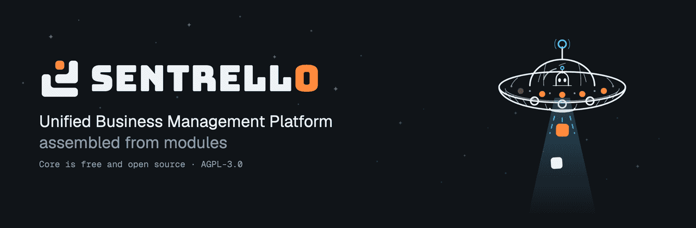

<p align="center">
  
</p>

<p align="center">
  <a href="LICENSE"></a>
  <a href="https://github.com/Sentrello/Sentrello/actions/workflows/ci.yml"></a>
  <a href="https://bun.sh"></a>
  <a href="https://www.postgresql.org/"></a>
  <a href="https://www.typescriptlang.org/"></a>
  <br>
  <a href="https://github.com/orgs/Sentrello/packages"></a>
  
  
  <a href="#project-status"></a>
  <a href="SECURITY.md"></a>
</p>
<div id="user-content-toc">
<ul align="center" style="list-style: none;">
  
# **Run your whole business on software you actually own.**

</ul>
</div>
<p align="center">
  Sentrello is a Unified Business Management Platform (UBM) for small businesses: CRM, Accounting, Booking, Shop, Subscriptions, Projects, Links, Newsletter, Documentation, Storage and SEO.<br>
  Start with the free core. If you need more upgrade to Pro, and add only the modules you need.<br>
</p>
<div align="center">

### **One Server, One Price, Unlimited Users**

</div>

---

## Install

On any Linux server with Docker or Podman:

```bash
curl -fsSL https://get.sentrello.com | bash
```

**Podman needs a compose provider** — `dnf install podman-compose`, `apt
install podman-compose`, or `pip3 install podman-compose`. Podman stopped
bundling one, and the installer will tell you the same thing if it is missing.

The installer asks for a domain and an administrator email, generates its own
database password and signing secrets, starts PostgreSQL and the app, and runs
migrations. A few minutes later you have a working instance. Put a reverse proxy
with TLS in front of it and you're done.

Prefer to look before you run a script? It's [right
here](https://get.sentrello.com/install.sh), and the image is
`ghcr.io/sentrello/core` (amd64 and arm64).

Manage it afterwards with `sentrello status | update | rollback | backup |
restore | logs`. Updates can also be applied from Settings, and every update
takes a database backup before it starts and refuses to continue without one.

**[Running it yourself](docs/self-hosting.md)** covers TLS, email, backups,
updates and what to look at when something is wrong — including exactly what an
instance does and does not send anywhere.

---

## Why this exists

Look at what a five-person business pays for today. A CRM at $25 a seat. An
invoicing tool at $30. A bookkeeping subscription at $40. A forms product at
$20. None of them speak to each other, so somebody re-types the same customer
four times and the books are always a fortnight behind. Then you hire a sixth
person and every one of those bills goes up again.

The usual dodge is to share one login. That works right up until you need to
know who changed the invoice.

**Sentrello is the whole thing, on one server, for one price, with as many
people as you like.** Raise an invoice and it is in the ledger before you close
the tab. A form on your website drops a lead into the pipeline you actually
look at. The profit and loss is computed from journal entries, so it is right
by construction rather than right because somebody reconciled a spreadsheet on
Friday.

And the database is yours. Not "exportable" — **yours**, on your machine, in
PostgreSQL, queryable with `psql` at two in the morning if that is what the
accountant needs. If this project vanished tomorrow, your instance keeps
running and your data keeps being readable.

- **Give everyone their own account,** with the permissions their job needs,
  because it costs nothing to do so. Audit trails only work when people sign in
  as themselves.
- **Nothing about your customers reaches us.** A paid instance sends one
  licence check an hour — a key and an instance id. A Free instance need never
  contact us at all.
- **Start free and stay free if you like.** The free core is not a trial. It
  doesn't expire, doesn't nag, and doesn't need a licence key.
- **Grow by module, not by seat.** Add a shop, a booking diary or a newsletter
  when the business needs one, and pay nothing for the ones it doesn't.

One command puts it on a $6 VPS. Go and take it for a walk.

---

## What it looks like

Every screenshot in the documentation is a real instance, captured by an
automated run against a live server. Nothing is a mock-up. The screens below
are the free core and need no licence key; the ones in the module and Pro pages
are the same run against an instance that has one.


**[Take the tour →](https://docs.sentrello.com/docs/getting-started/what-it-looks-like)**
— the dashboard, CRM, quotes and invoicing, accounting, forms, roles and
settings, screen by screen.

---
## Free vs Pro

The **free core** is this repository: AGPLv3, unlimited users, no licence key,
no expiry. It is a real product, not a trial.

**Pro** is a subscription that unlocks the paid half of the modules already in
the core — the same screens, opened up — and gives you access to buy the
optional modules, which are not sold on their own. It is **per instance, not per
person**: hiring somebody costs nothing.

**The tax work is free, all of it.** The UK VAT return in the nine boxes
Making Tax Digital expects, the Canadian GST/HST return, US sales tax with the
state nexus thresholds, the EU One Stop Shop return, and a structured EN 16931
e-invoice — every one of those is in this repository, computed from the ledger,
and runs on an instance with no licence key at all.

Dropping back to free leaves every record you created in place, still readable
and still exportable. The Pro screens simply stop.

**[The full comparison, line by line →](https://docs.sentrello.com/docs/free-vs-pro)**

---
## The optional modules

Each is a whole application, not a feature — and each is built so another
module can consume what it produces: the Shop's orders reach Accounting, a
booking becomes an invoice. They need a Pro subscription underneath; none is
sold against the free core.

| Module | What it is | Availability |
|---|---|---|
| **[Booking](https://docs.sentrello.com/docs/modules/booking)** | Diary, availability, resources, and a page customers book themselves on | Available |
| **[Shop](https://docs.sentrello.com/docs/modules/shop)** | Products, stock by location, storefront, checkout and payments | Available |
| **[Subscriptions](https://docs.sentrello.com/docs/modules/subscriptions)** | Plans, subscribers, trials, pauses, and a customer who can change or cancel their own | Available |
| **Projects** | Projects, tasks, boards, milestones, and the hours that become invoice lines | Available |
| **[Links](https://docs.sentrello.com/docs/modules/links)** | Short links on your own domain, and the click → signup → sale chain | Available |
| **[Newsletter](https://docs.sentrello.com/docs/modules/newsletter)** | Lists, segments, templates, campaigns and delivery | Available |
| **[Documentation](https://docs.sentrello.com/docs/modules/docs)** | Publishes your own documentation site | Available |
| **[Storage](https://docs.sentrello.com/docs/modules/documents)** | Folders, versions, sharing and retention, with warnings before a certificate lapses | Available |
| **[SEO](https://docs.sentrello.com/docs/modules/seo)** | Keyword research, rank tracking, audits, backlinks, competitors — see below | Available |
| **POS** | Ring up a sale in person, take the money, and the books are written without anybody typing it again. Needs the Shop | **In development — not for sale** |
| **HR** | Records for the people who work for you, and the time off they take | **Being built** |
| **Helpdesk** | Customer questions arriving as tickets in a queue, rather than into one person's inbox | **Being built** |

**POS is not for sale, and has no date.** It was withdrawn from the catalogue
on 15 September 2026 on its own review: a cash-handling product has to be able
to void, refund, comp and discount a sale, count a drawer blind rather than
open, print a receipt and keep the closure it printed. Those controls exist
now; the rebuild for the screens it is actually used on, the card readers and
the receipt printers do not. Nobody has lost anything — no licence is sold
before 1 October 2026 — and nothing here says when it returns, because we do
not know. When it does it is a **plugin**: it needs Shop, it is bought
separately at half a module's price, and it shares Shop's catalogue rather than
keeping a menu of its own.

**HR and Helpdesk are being built, and are not dated either.** Neither has
code yet, so anything said about them here beyond what they are for would be a
guess with a quarter attached. They are separate modules, split apart on
purpose: a business that wants a ticket queue rarely wants a leave calendar in
the same week.

Projects is a module like the others, bought on its own. It shipped inside Pro
until 15 September 2026, which meant every Pro subscriber got it whether they
wanted it or not and nobody could buy it deliberately.

---

## SEO, and the one thing it does differently

Every other module runs entirely on your server. SEO cannot: keyword volumes,
rankings and backlink graphs come from a search-data provider, because nobody
self-hosts a search index.

So it is the one module with **two ways to buy the data**, chosen in a single
setting — our cloud at the provider's cost plus 40% with an allowance included,
or your own provider account, talking to them directly with nothing passing
through us. The second earns us nothing and exists because an agency large
enough to hit a provider's minimum deposit is exactly the one that would object
to its clients' keywords transiting somebody else's server.

**[What the module does, and how the two options differ →](https://docs.sentrello.com/docs/modules/seo)**

---
## Founder pricing

**v1 lands on 1 October 2026.** For the **first 90 days** after it does, Pro
subscriptions bought during that window keep their price for as long as they
stay active. Locked — not an introductory rate that steps up next year.

Nothing is sold before it exists: a module that is not finished is not on the
price list, at any price. One that is finished inside the window goes on sale
at the founder price like everything else, so waiting for it costs you nothing.

**Watch this repository** to be told the day it does, and **star it** if
you want to see a business platform exist that nobody has to rent seats on.

[](https://github.com/Sentrello/Sentrello/stargazers)
[](https://github.com/Sentrello/Sentrello/subscription)

---

## Architecture

A **modular monolith**: one deployable service that discovers feature modules at
startup. One container to run and one database to back up — the right trade for
a business with no operations team.

Every feature, free or paid, implements the same contract:

```ts
import { defineModule } from "@sentrello/module-sdk";

export default defineModule({
  id: "crm",
  tier: "free",
  register(ctx) {
    ctx.registerNav({ id: "crm", label: "Contacts", order: 10 });
    ctx.app.get("/api/contacts", requireSession(), requirePermission({ crm: ["read"] }), handler);
  },
});
```

Paid features are gated twice: the loader refuses to register a module the
licence doesn't cover, and each route checks permissions independently. Licences
are Ed25519-signed tokens verified **offline** against a public key embedded in
this repository — so an instance keeps working without reaching the internet,
and a missing or expired token degrades to Free rather than breaking.

| Layer | Choice |
|---|---|
| Runtime | Bun 1.3.14, TypeScript strict |
| API | Hono |
| Database | PostgreSQL 17 with Drizzle ORM |
| Auth | Better Auth — email/password, optional Google, org-scoped roles |
| Jobs | pg-boss, inside Postgres (no Redis) |
| Front end | React, Vite, TanStack Query, Tailwind |
| Deploy | Docker Compose, multi-arch |

Two rules the codebase does not bend on: **money is integer cents**, never
floating point, with tax rates in integer millionths (Quebec's 9.975% QST is
exactly `99750`); and **bookkeeping is
double-entry**, so every financial event posts a balanced journal entry or
throws, and every report is computed from the ledger rather than summed from the
invoice table.
**[Why, and what it means for your books →](https://docs.sentrello.com/docs/core/money)**

---

## Development

```bash
bun install
cp .env.example .env
docker compose -f docker-compose.dev.yml up -d   # PostgreSQL
bun run db:migrate
bun run dev                                       # API + web
```

Then:

```bash
bun test          # every test runs against a real PostgreSQL, not mocks
bun run typecheck
bun run lint
```

Requires [Bun 1.3.14](https://bun.sh) exactly and a Docker runtime.
[CONTRIBUTING.md](CONTRIBUTING.md) covers the DCO sign-off, the house style and
what a good pull request looks like.

---

## Project status

**Early access, with v1 on 1 October 2026.** The free core is built and tested, and
the install path works end to end on both Docker and Podman. It has not yet been
run by a large number of businesses, so expect rough edges and please report
them — the Podman path was fixed in v0.13.0 because somebody did.

Live bank feeds arrived in Pro: a business connects its bank through a data
provider and transactions arrive on their own, alongside the CSV import that is
still there for anyone who would rather not connect anything.

E-invoices are **compliant, not connected**. The documents this produces pass
the network's own validator against EN 16931, Peppol BIS 3.15 and XRechnung
3.0.2 — but sending one over the Peppol network needs an access point, and that
is not live here and will not be on 1 October. You get a valid document to hand
over; we do not hand it over for you.

Not yet available, and not promised on any date: QuickBooks or Xero sync,
mobile apps, and the POS.

**Markets:** the United States first, then Canada, the United Kingdom and the
EU. That is a scoping decision, not a shipping restriction — it decides which
tax regimes and statutory features exist at all. **Italy and Poland are
deliberately outside it**: both require every business to file through a
national e-invoicing system, and half-supporting one of those would be worse
than saying plainly that we do not.

---

## Security

Found a vulnerability? **Please don't open a public issue** — email
`security@sentrello.com`. [SECURITY.md](SECURITY.md) has the scope, the response
times you can expect, and what the design already assumes.

---

## Licence

[GNU AGPLv3](LICENSE). You may run, study, modify and share this software. If
you modify it and offer it to others over a network, you must publish your
changes under the same licence.

**Modules are exempt, on purpose.** A [module linking exception](LICENSE) at
the top of the licence lets you write a module against `@sentrello/module-sdk`,
load it into Core, and license and sell that module on whatever terms you like.
Core itself stays AGPL — modify Core and those changes are still copyleft — but
the module you wrote is yours.

Pro features and optional modules are separately licensed commercial software
and are not covered by the AGPL.

Built by [Sentrello LLC](https://sentrello.com).
