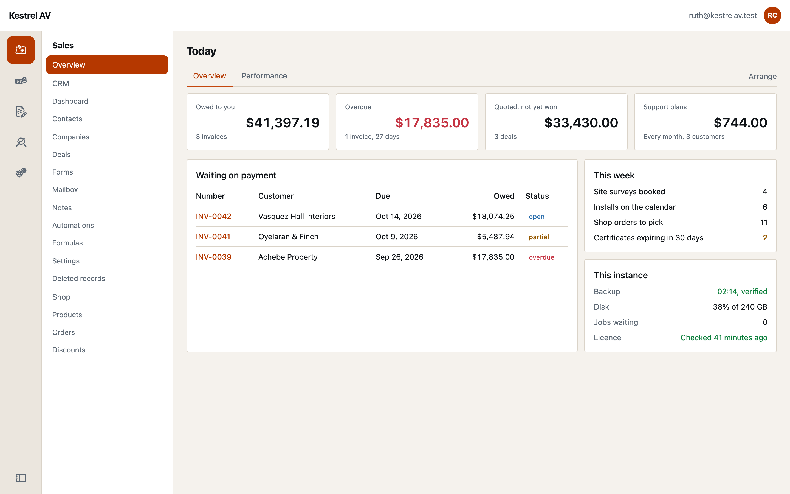
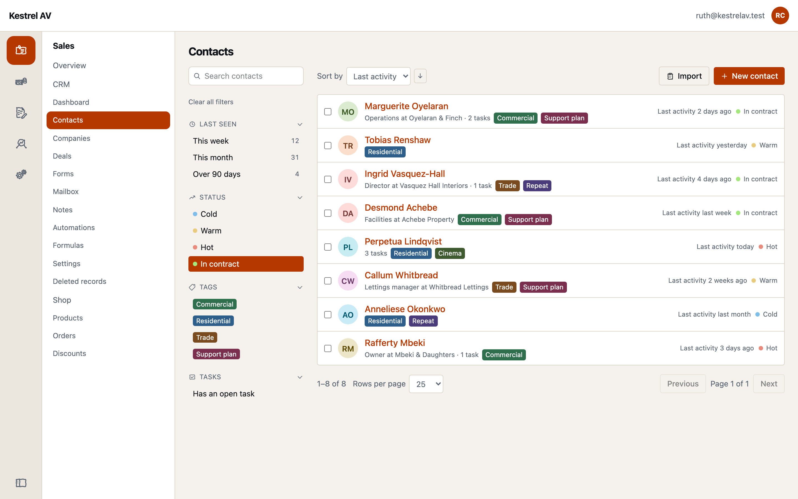
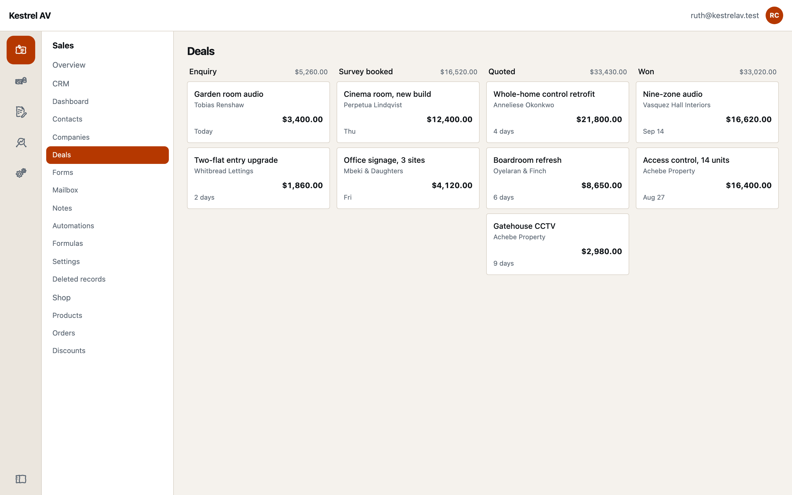
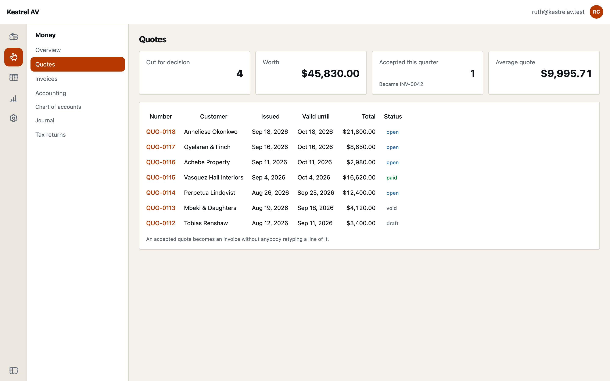
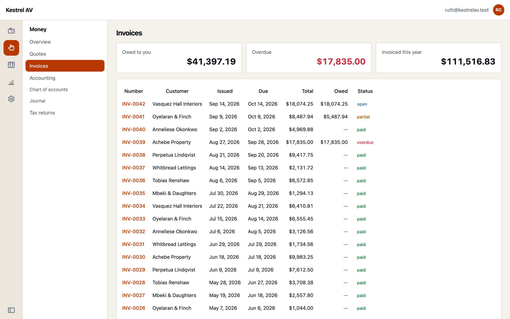
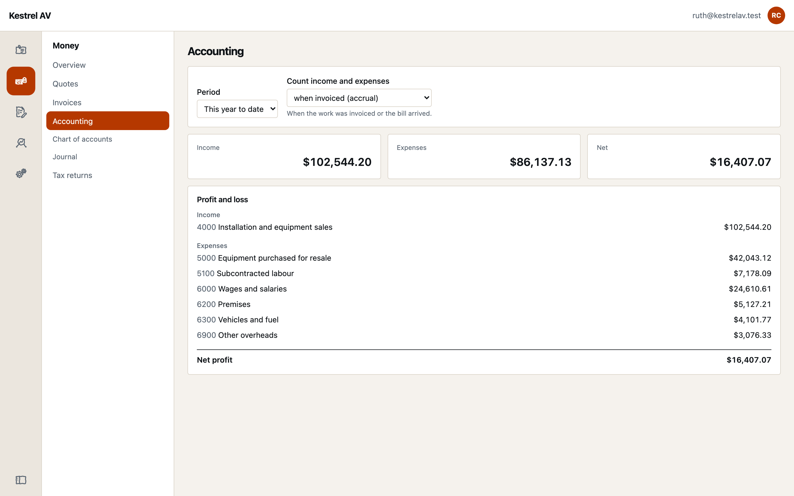
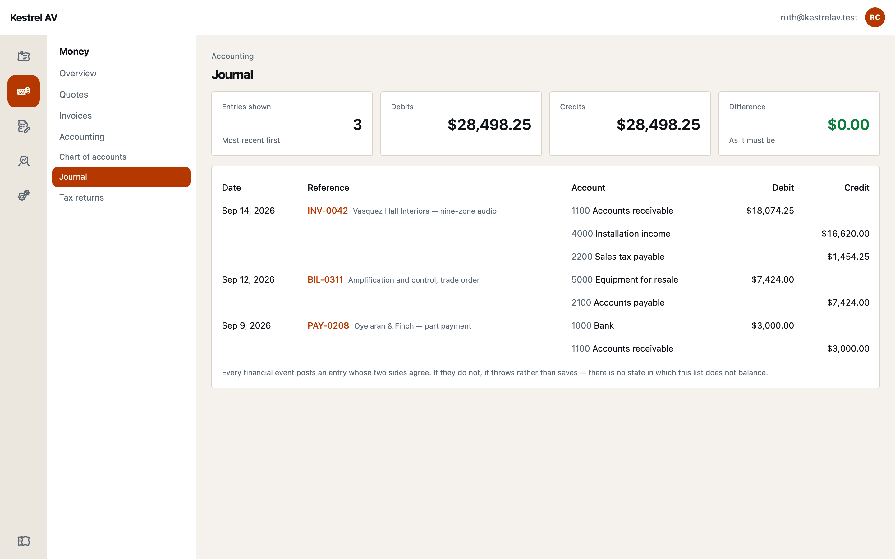
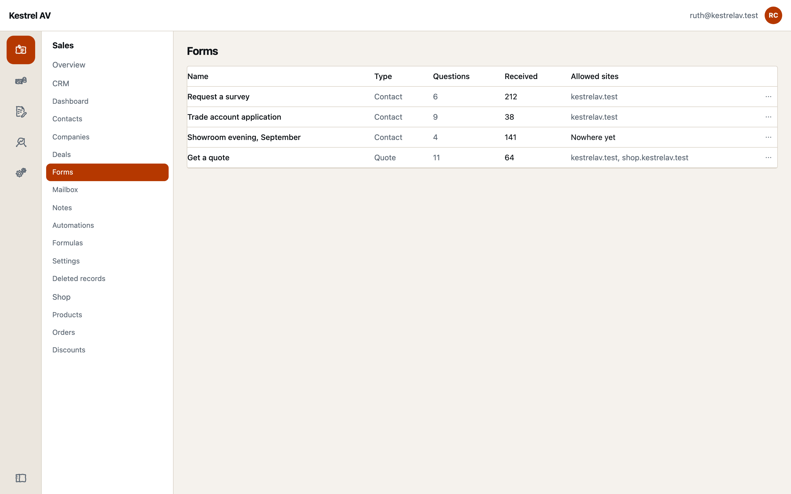
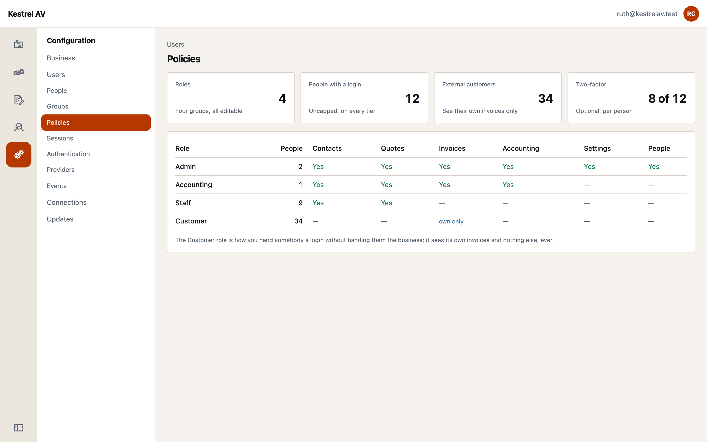
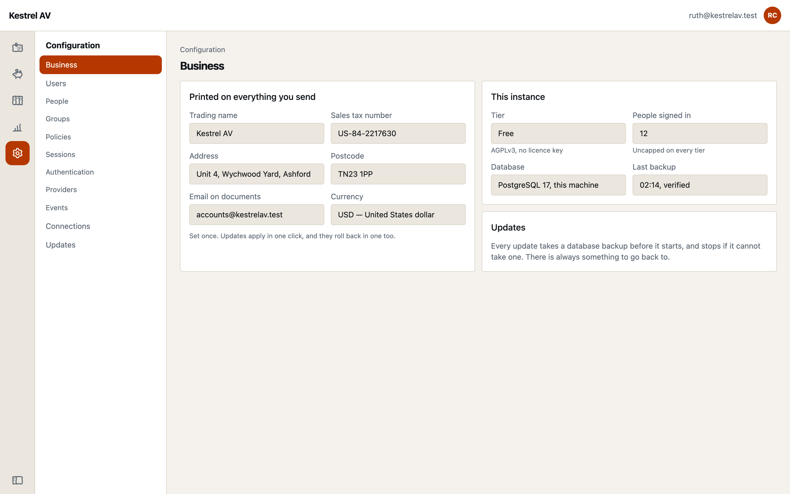

# What it looks like

Everything below is **one install, one server, one login**. Every screenshot is
a real instance running the free core, captured by an automated run against a
live server — nothing here is a mock-up, and nothing here needs a licence key.

## Dashboard

What is owed, what is overdue, what needs answering — and how the server itself
is holding up, which matters when the server is yours.

## CRM

Contacts, companies, activities, tasks, notes and tags, with CSV import and
export so nothing is a one-way door.

The pipeline is a board, and every column carries what it is worth.

## Quotes and invoicing

Quotes go out, get accepted, and convert into an invoice without being retyped.

Invoices have per-line tax, sequential numbering, partial payments, a discount
for paying early, and several drafts can be merged into one bill. Issuing one
posts it to the ledger there and then.

## Accounting

A chart of accounts, money in and out, and a profit and loss and balance sheet
for any period — on the cash basis or the accrual basis, from the same books.

Underneath is a real double-entry journal. Every figure on the screen above is
derived from these entries, and every entry balances or it was never written.
See [How money is handled](/core/money) for why that is not negotiable.

## Forms

Contact and quote forms you embed on any website, posting straight into your own
instance. Origin allow-list, rate limiting and a honeypot, because they face the
internet by design.

## Accounts and roles

Five policies out of the box — Admins, Executives, Managers, Staff, and an
external Customers policy that only ever sees its own invoices — plus four
groups: Sales, Marketing, Accounting and Customer Service. Every one of them is
data you can edit, copy or throw away.

A **policy** is how senior somebody is, given to a person directly. A **group**
is what department they are in, so moving somebody between departments is one
change, not nine.

## Settings

Your business name, address and tax number — which appear on every invoice,
quote and customer page you send — plus connections to third-party services,
one-click updates and rollback, and which modules are installed.

---

Next: [what Pro adds](/free-vs-pro), or [install it](/getting-started/install).
