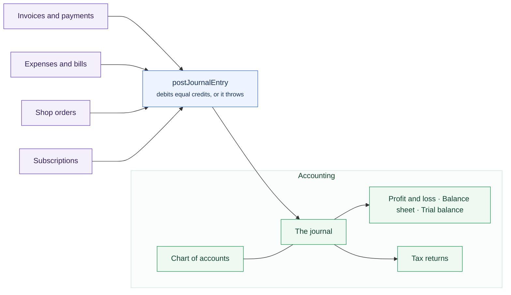

# Accounting

Sentrello keeps **real double-entry books**. An invoice, a payment, an expense,
a bill: each posts a journal entry whose debits equal its credits, or it does
not post at all.

That is not bookkeeping theatre. Reports are read from the ledger rather than

recalculated from invoices, which is why they cannot drift away from what
actually happened.

Everything that moves money arrives here the same way, and every report is
read back off the same place.

## Accounts

The chart of accounts is the list of buckets money moves between: bank
accounts, income, expenses, money owed to you, money you owe. You start with a
chart already built, and you add to it.

## Money in and out

The main screen answers the question a business actually asks. What came in,
what went out, what is left. Expenses are recorded here with a category, a
date, and a receipt if you have one.

## The journal

Every entry, in order, with both sides of each. This is where you look when a
figure is not what you expected: the entry that caused it is here, with what it
came from.

## Stock, and what it cost you

If you sell physical things through the [Shop](/modules/shop) or over the
counter, your books follow the stock as well as the money.

A delivery puts the goods on your balance sheet as **Inventory**, an asset,
because that is what stock on a shelf is, and it records what you owe the
supplier. Nothing is an expense yet. You have swapped a debt for goods rather
than spent anything.

When one of those goods is sold and leaves, its cost moves out of Inventory and
into **Cost of Sales**, against the sale that took it. That is what makes gross
profit mean something: a sale of $40 on an item that cost you $22 shows $18,
not $40. Breakages and a stocktake that comes up short are costs too. Something
a customer brings back goes the other way, and the cost of that sale is undone
rather than a debt to a supplier invented.

### Which cost

Buy the same thing twice at two different prices and something has to decide
what the one you just sold cost you. Sentrello offers the two answers accepted
everywhere it sells (the US, the UK, the EU and Canada), and you pick one in
the Shop's settings:

- **First in, first out** charges the price of the oldest ones you still have.
  This is the default, and what most businesses use.
- **Weighted average** charges every one the same: what all your stock is worth,
  over how many there are.

Each delivery is recorded with what it cost, so both answers come off the same
history. Changing the setting changes what future sales are charged; it does not
rewrite what is already in the books.

:::warning[Ask your accountant]
Once you are trading, this is not a setting to change on a whim. It moves your
reported profit. It is also the kind of choice an accountant will have an
opinion about, and in some places a reason for it.
:::

:::note[If your margins look too good]
A product with no cost recorded posts nothing at all rather than posting zero.
A journal line claiming an item was free is worse than a gap you can see in the
margin, so a variant nobody has priced never reaches Cost of Sales. That is
usually the reason.
:::

## Reports

Profit and loss and a balance sheet, over any period. Both are read from the
ledger rather than recalculated, so agreeing with the journal is not something
they have to try to do.

:::tip[The balance sheet is the check]
It only balances if the books do. If a figure is not what you expected, the
journal shows the entry that caused it.
:::

## With Pro

Pro adds the parts a growing business needs: [bills you owe](/pro), recurring
bills, bank statement reconciliation, budgets by month, multi-currency, and the
further reports — trial balance, cash flow, tax summary, income and expenses by
category, aged receivables and payables, and CSV export. Underneath, the free
books stay exactly as they are.
