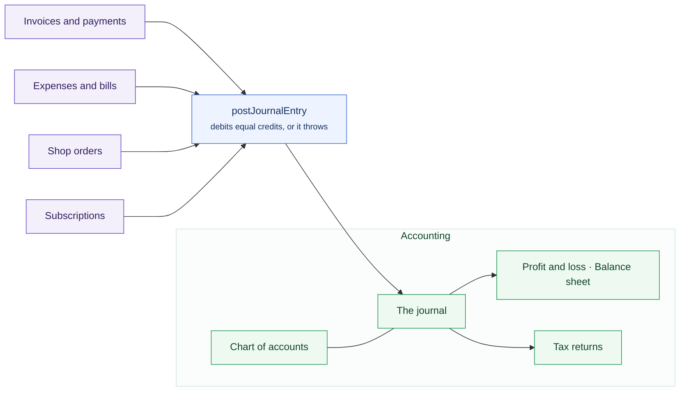

# Accounting

Sentrello keeps **real double-entry books**. An invoice, a payment, an expense,
a bill: each posts a journal entry whose debits equal its credits, or it does
not post at all.

That is not bookkeeping theatre. Reports are read from the ledger rather than

recalculated from invoices, which is why they cannot drift away from what
actually happened.

Everything that moves money arrives here the same way, and every report is
read back off the same place.

```mermaid
flowchart LR
  classDef screen fill:#eef4ff,stroke:#3b6fd4,color:#16305e
  classDef own fill:#eefaf1,stroke:#219653,color:#10442a
  classDef out fill:#f4f0fb,stroke:#6b47c4,color:#31205e
  classDef pub fill:#fff4ec,stroke:#c4470f,color:#5a2207
  INV["Invoices and payments"]:::out
  EXP["Expenses and bills"]:::out
  SHOP["Shop orders"]:::out
  SUB["Subscriptions"]:::out

  POST["postJournalEntry<br/><small>debits equal credits, or it throws</small>"]:::screen
  subgraph OWN[" Accounting "]
    JR["The journal"]:::own
    COA["Chart of accounts"]:::own
    RPT["Profit and loss · Balance sheet"]:::own
    TAX["Tax returns"]:::own
  end

  INV --> POST
  EXP --> POST
  SHOP --> POST
  SUB --> POST
  POST --> JR
  COA --- JR
  JR --> RPT
  JR --> TAX
  style OWN fill:#fbfdfc,stroke:#cfe4d8,color:#10442a
```

## Accounts

The chart of accounts is the list of buckets money moves between: bank
accounts, income, expenses, money owed to you, money you owe. You start with a
chart already built, and you add to it.

## Money in and out

The main screen answers the question a business actually asks. What came in,
what went out, what is left. Expenses are recorded here with a category, a
date, and a receipt if you have one.

## Where a payment lands

Money goes to the account it is actually in:

- **Cash** for notes and coins.
- **Payments in Transit** for anything a card processor took, until the
  processor pays it out to your bank.
- **Your bank account** for everything else: a bank transfer, a cheque, a
  payment nobody described. If you have marked one account as a bank, that is
  the one. Otherwise it is Bank Account.

When you record a payment against an invoice, the method you pick decides
which. When you record money in and out, you choose the account yourself.

With [Pro](/pro), the same rule follows the money further. A bill you pay comes
out of the bank unless you say otherwise. A line on your bank statement that
you match to an invoice, a bill or a payment you already recorded lands in the
bank that statement belongs to. And when a payout arrives under your
processor's name (Stripe, PayPal, Square), the bank screen offers it as a
payout. Confirm it and the money moves from Payments in Transit to the bank,
rather than being counted as income a second time.

## The journal

Every entry, in order, with both sides of each. This is where you look when a
figure is not what you expected: the entry that caused it is here, with what it
came from.

## Stock, and what it cost you

If you sell physical things through the [Shop](/modules/shop) or over the
counter, your books follow the stock as well as the money.

A delivery puts the goods on your balance sheet as **Inventory**, an asset,
because that is what stock on a shelf is. What you owe for them waits in
**Stock Received, Not Billed** until the supplier's bill arrives. Nothing is an
expense yet. You have swapped a debt for goods rather than spent anything.

When you enter that bill (with [Pro](/pro)), choose Stock Received, Not Billed
as its category. The debt then moves to what you owe suppliers, once, instead
of being recorded a second time beside the first.

When one of those goods is sold and leaves, its cost moves out of Inventory and
into **Cost of Sales**, against the sale that took it. That is what makes gross
profit mean something: a sale of $40 on an item that cost you $22 shows $18,
not $40. Breakages and a stocktake that comes up short are costs too.

Something a customer brings back goes the other way: the goods return to
Inventory and the cost of sale is reversed, rather than a debt to a supplier
being invented. It comes back at what the next one is worth under whichever
basis you chose, because nothing records which delivery that particular item
came off — so where your buying prices have moved, the reversal and the original
cost will not be the same figure to the penny.

### Which cost

Buy the same thing twice at two different prices and something has to decide
what the one you just sold cost you. Sentrello offers the two answers accepted
everywhere it sells (the US, the UK, the EU and Canada), and you pick one in
the Shop's settings:

- **First in, first out** charges the price of the oldest ones you still have.
  This is the default, and what most businesses use.
- **Weighted average** charges every one the same: what all your stock is worth,
  over how many there are.

Each delivery is recorded with what it cost, so both answers come off the same
history. Changing the setting changes what future sales are charged; it does not
rewrite what is already in the books.

:::warning[Ask your accountant]
Once you are trading, this is not a setting to change on a whim. It moves your
reported profit. It is also the kind of choice an accountant will have an
opinion about, and in some places a reason for it.
:::

:::note[If your margins look too good]
A product with no cost recorded posts nothing at all rather than posting zero.
A journal line claiming an item was free is worse than a gap you can see in the
margin, so a variant nobody has priced never reaches Cost of Sales. That is
usually the reason.
:::

## Reports

Profit and loss and a balance sheet, over any period. Both are read from the
ledger rather than recalculated, so agreeing with the journal is not something
they have to try to do.

:::tip[The balance sheet is the check]
It only balances if the books do. If a figure is not what you expected, the
journal shows the entry that caused it.
:::

## With Pro

Pro adds the parts a growing business needs: [bills you owe](/pro), recurring
bills, bank statement reconciliation, budgets by month, multi-currency, and the
further reports — trial balance, cash flow, tax summary, income and expenses by
category, aged receivables and payables, and CSV export. Underneath, the free
books stay exactly as they are.

Everything below needs [Pro](/pro).

### Bills and suppliers

**Money → Spending → Bills** holds what you owe. A new bill is a draft, and
nothing reaches the books until you **Approve** it, so a mistyped draft costs
nothing to throw away. **Pay in full** records that you paid it; it does not
move any money.

A supplier's credit note goes in **Credits from suppliers** with **Record a
credit**. It reduces what you owe straight away, and you put it against a bill
when you know which one.

**Repeat monthly**, on a bill, copies it into a new draft each month. Nothing
is approved or paid for you; the drafts wait in the list like any other.
**Bills that repeat** lists them, with **Stop** and **Start again**.

A bill entered on screen has one line and is in your own currency.

### The bank

The **Banking** screen, under Money, is where your bank's side of the story
comes in.

**A live feed** brings transactions in every hour, with **Fetch now** for when
you cannot wait. Feeds come through Plaid, on an account you open with them, for
banks in the United States, Canada and the United Kingdom. Under **Your bank,
brought in automatically**, set Plaid up with its client ID and secret, leave
**These are test details, not my real bank** ticked while you try it with
Plaid's sandbox, and press **Check they work**. Then **Connect a bank**.
Connecting and disconnecting a bank is for an administrator.

**A statement file** works with any bank. **Import a statement** takes a CSV
with a date column and an amount column (a description is optional), up to
8 MB. Rows whose date or amount cannot be read are listed back to you rather
than imported as nothing.

**Matching.** A line whose amount is exactly what an open invoice or bill is
for shows under **These look like they settle something**. Confirm it and the
payment is recorded against that invoice or bill. A payout from your card
processor is offered the same way, and moves the money out of Payments in
Transit. Anything else you **Put it in** an account yourself.

**Rules** do that last part for you. A rule says *when the line contains these
words, and the money went out, put it in Fuel*. While you write it, the screen
counts the lines it would catch and shows some of them, using the same matching
that will apply it. Rules run after each feed fetch, and over everything waiting
when you press **Run them now**.

**Reconciling.** Under **Reconcile against a statement**, pick the account,
the date the statement closes and its closing balance, then tick the lines it
shows. **It agrees** stays greyed out until the difference is nothing. There
is no way to close one that is out by a penny, because a reconciliation you can
force through tells you nothing.

### Paying suppliers from the bank

On a Plaid connection, **Paying from the bank** (on **Money → Settings → Tax
and currency**) sends money over ACH, same-day ACH, RTP or wire. **Add somebody
to pay** with their US routing and account number, then say how much and from
which account. The screen shows exactly what will be sent, and **Send it**
asks the bank to authorize the payment before it goes. A payment can repeat
weekly, monthly, quarterly or yearly. Sending needs its own permission.

A payment sent from here is not yet tied to a bill. It posts as a general
expense, and any bill it paid stays open until you deal with it.

### Fixed assets

The **Assets** screen, under Money's Planning heading, holds what the business
owns and uses up: the van, the machine, the laptops. **Add an asset** with what
it cost, what it will be worth at the end, and how many months it lasts, and
choose whether it loses value the same every month or faster at first.
Depreciation posts on the first of each month. **Catch up on depreciation**
posts any months that were missed.

When it goes, mark it **sold or scrapped** and say what it sold for. Disposal
posts three things together: the cost comes off the balance sheet, the
depreciation built up against it comes off with it, and the difference between
what it was still worth and what you got is a gain or a loss.

### Budgets

The **Budgets** screen sets figures against each income and expense account,
for the whole year or for a single month. Choose a month and each line shows
what was allowed for it (that month's own figure plus a twelfth of the yearly
one), what actually happened, and what is left, in red when it has gone over.

### Closing a period and a year

On **Money → Settings → Tax and currency**, **Closing the books** sets a date.
Nothing can post on or before it — no invoice, no payment, no expense — until
you move it. That is how last quarter stays the figures you reported.

**The end of a year** closes the year properly: **Close the year** posts a real
journal entry that moves the year's income and expenses into what the business
has kept, and closes the books through that date. Reopening the year reverses
that entry rather than deleting it.

On the journal, **New entry** posts an entry by hand, and **Reverse** undoes
one. An entry can be reversed once.

### Jobs, departments and places

Pro can tag money with what it was for and where. Set up **Jobs and
departments** and **Branches and sites** at the top of the Bills screen, then
choose them on a bill line under **For** and **Where**. The tags travel on the
journal lines themselves.

Profit and loss on the Summary screen can then be read for one job or
department rather than the whole business, on the accrual basis.

### More than one currency

Record exchange rates in the **Currency** card on **Money → Settings → Tax and
currency**. Once a second currency has a rate, the invoice and quote forms
offer a **Currency** picker. The rate is fixed on the document the day it is
raised, so last year's figures do not move when a rate does, and when the
payment arrives the difference goes to an exchange gain or loss. A document in
a currency with no rate recorded is refused rather than converted at one to
one.

### Reports

**Money → The books → Reports** adds, for any range of dates: the trial
balance, **Cash in and out**, **Where the money goes** by category, the
**Tax** you charged, reclaimed and owe, the UK **VAT return** boxes, **What is
owed to this business** and **What this business owes** by age, and
**Download the ledger as a spreadsheet**.

A customer's statement of everything they owe opens from **Statement of
account** beside their name on any invoice.
