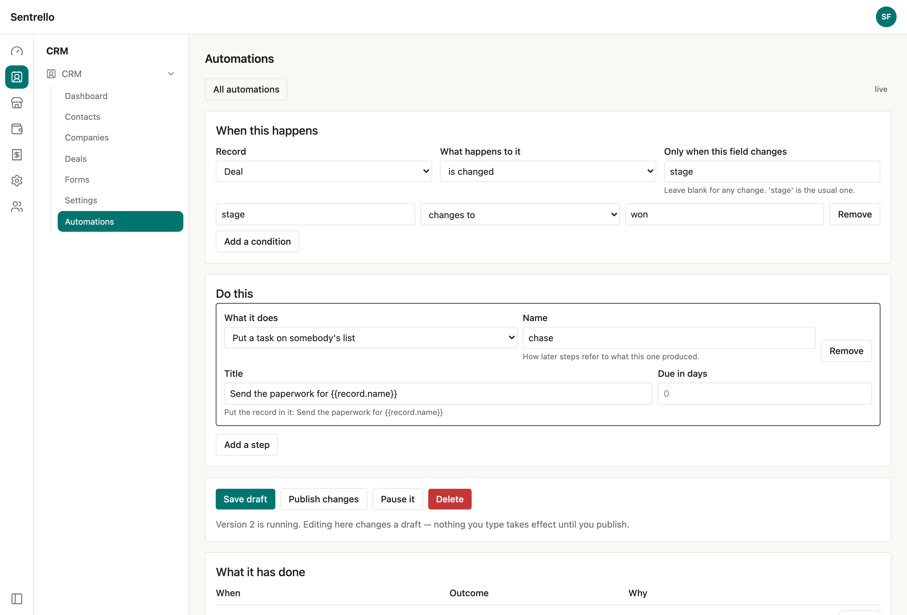
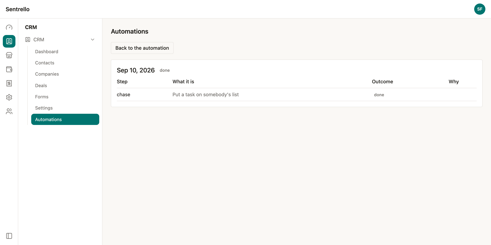

# Automations

**When a deal's stage becomes won: wait two days, put a task on somebody's list,
email the customer.** That is an automation, and it is the difference between a
business that remembers to follow up and one that means to.

Automations are part of **Pro**, under CRM → Automations.

## The shape of a rule

Every automation is two halves.

**When this happens** — a record, what happens to it, and optionally which field
has to change and what has to be true.

**Do this** — steps, in order. Each one runs only if the one before it did.

## Choosing what sets it off

| Setting | What it means |
|---|---|
| **Record** | Deal, Contact, Company or Task |
| **What happens to it** | Created, changed, deleted, or any of them |
| **Only when this field changes** | Narrows it to a real change in that field |
| **Conditions** | What must be true of the record |

**"Only when this field changes" is the setting that matters most**, and the one
people miss. Without it, a rule that says "a deal whose stage is won" fires again
every time anybody edits that deal afterwards — the description, a note, a phone
number. The customer gets the congratulations email once a week for ever.

With `stage` in that box, the rule only fires on a save that actually moved the
stage.

### Conditions

A condition is a field, a test, and a value. Two of the tests are about the
**change** rather than the state, and they are usually what you want:

- **changes to** — true once, on the save that made it so
- **changes from** — true once, on the save that moved it away

The rest — *is*, *is not*, *contains*, *is empty*, *is more than* — ask about the
record as it now stands.

You can reach into a record's shape with a dot: `address.city`.

## What a rule can do

| Step | What it does |
|---|---|
| **Only carry on if…** | Stops the whole rule unless the conditions hold |
| **Wait** | Days, hours or minutes. Survives a restart |
| **Put a task on somebody's list** | With a title and a due date |
| **Send an email** | To an address, or to the record's contact |
| **Change a field** | On the record the rule is about |

### Putting the record into what you write

Anywhere you type text, `{{record.name}}` becomes that record's name.
`{{record.value}}`, `{{record.contact.firstName}}` — anything the record holds.
A later step can read an earlier one: `{{steps.chase.id}}`.

A value that is not there leaves a blank rather than the word "undefined".

### Email and consent

**Marketing email is only sent to people who have agreed to it.** Sentrello
already records that agreement — the newsletter signup writes it, the contact
screen shows it — and an automation is checked against the same record.

If a contact has not agreed, the rule **stops and says so**: *that contact has
not agreed to marketing email*. It is recorded as the automation working
correctly, not as a failure, because it is.

Set **What kind of message** to *About something they bought* for messages that
are not marketing — "your invoice is attached", "your order has shipped". Those
do not need consent and are not held back.

## Nothing runs until you turn it on

**Editing an automation never changes what is running.** Saving keeps a draft.
The version that is live stays live until you publish.

That is deliberate, and it is the thing people get wrong about automation
elsewhere: a half-finished rule firing on real customers, sending real email, is
the worst thing this feature can do. The screen tells you which version is
running and that what you are looking at is not it.

**Pause it** stops it without deleting anything, and remembers which version was
running — usually the thing you want to look at next.

## Seeing what it did

Every firing is kept, with each step, what it produced, and why anything stopped.

| Outcome | What it means |
|---|---|
| **done** | Every step ran |
| **stopped** | A filter did not pass, or a step declined — with the reason |
| **failed** | Something went wrong, with the reason |
| **waiting** | It is part-way through a wait |

An automation whose workings you cannot see is one nobody dares turn on. "It ran"
is not an answer to "so why did nothing happen".

## The safety rails

Worth knowing, because they are the things that go wrong with automation
everywhere else:

- **An automation acts as the person who published it.** It can never do more
  than they can, so writing a rule is not a way around your own permissions.
- **A rule's own work does not set off other rules**, unless you say it should.
  "On update, update" is the first automation anybody builds by accident.
- **Chains stop at five deep**, even when you do ask for them.
- **One change fires a rule once**, however many times the system notices it.
- **Publishing needs its own permission** (`manage` on the CRM). Somebody who can
  edit a deal can change one deal; somebody who can publish an automation can
  change every deal that ever matches it.

## How quickly it happens

Usually within a second. Guaranteed within a minute: changes are written down and
swept regularly, so a restart, a crash or a deploy costs a minute rather than the
automation.

A **wait** is exact to the minute it sweeps, not to the second.

## What is not here yet

- **Branches** — one rule taking two paths. Today a rule is a straight line;
  write two rules with different conditions.
- **Starting one by hand**, or on a schedule. Today every rule watches a record.
- **Calling another system** over HTTP.
- **Rolling back to an earlier version** from the screen. Every version is kept,
  so nothing is lost — there is just no button for it yet.

There is deliberately **no step that runs code**. Some tools offer one; inside a
server you host yourself, that is a security surface bought for a convenience,
and an HTTP step covers the same ground without it.
