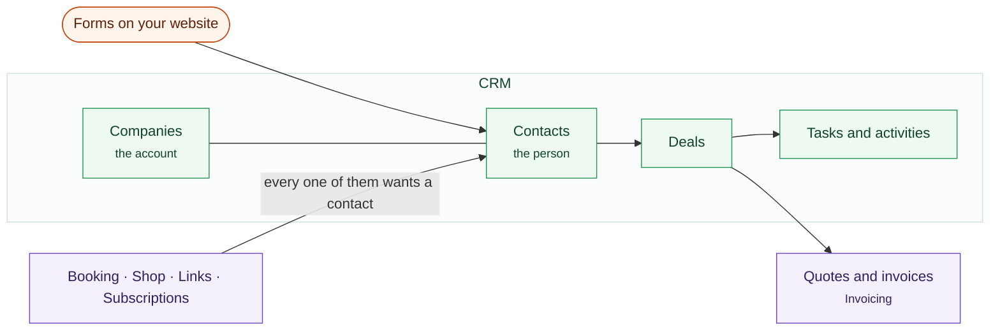

# CRM

Who your customers are, and what is currently happening with each of them.

Tags are yours to invent. The two above — a support plan, and who has come
back — are the kind that earn their place: both answer a question somebody
asks on the phone.

The records, and the two things every other module reaches for.

## Contacts and companies

A **contact** is a person. A **company** is an organization, and contacts
belong to it. A sole trader is a contact with no company; nothing forces you to
invent one.

Both carry the details you would expect: addresses, phone numbers, email. Both
carry **tags** as well, which is the fastest way to pull a group back out later.

Every list has a search box, and it reads more than the name. On contacts it
also reads email, phone, job title and **background**, the free-text field
where "met at the trade show, knows Priya" ends up. That scrap is often the
only thing anybody can remember about the person they are trying to find again.
On companies, search reads the sector, city, website and description.

## Deals

A **deal** is a piece of work you might win, moving through stages you define.
The board shows the pipeline and what each stage is worth, with every deal's
amount and its expected close date on the card.

Drag a card to another stage, or use the menu on it — which also moves a card
up and down inside its own column, so the order is the one you want to work in
rather than alphabetical. The menu is there because dragging is a mouse
gesture, and a keyboard and a touch screen both need somewhere else to go.

**A deal can become a quote.** The customer, the description and the figure
come across with it: three things somebody would otherwise retype, and three
chances to send a price that does not match what was discussed. You land on
Quotes with the new draft at the top, ready to send.

It arrives as one line, from the deal's own name and value. Sentrello does not
guess at a breakdown the deal never held.

The button is there at any stage, not only once a deal is won: quoting is often
how a deal gets won.

A quote then becomes an invoice with nothing re-entered. That holds when the
customer accepts it themselves from the portal, where the invoice is raised at
the moment they say yes.

## Notes, activities and tasks

Against any contact you can record a **note** (something that happened), an
**activity** (a call, a meeting, an email) and a **task** (something to do,
with a date). Overdue tasks show on the dashboard.

A company takes notes and tasks — "renew the retainer", "chase the PO" — which
belong to the account rather than to whoever answered the phone that day. An
activity is a thing that happened with a person, so it hangs off the contact;
the company page gathers its people's history into one column, which is the
same question asked the useful way round.

## Importing

Bring in a spreadsheet from **Contacts → Import**. Map the columns to fields,
look at how the first rows will read, and only then import. Rows that cannot be
read are listed rather than quietly skipped.

## The customer portal

Every invoice and quote you send carries a link to a page holding that
customer's own documents. There is no account and no password: the link is the
credential, thirty-two random bytes of it, and it resolves to exactly one
contact. That is the whole design — asking somebody who buys from you twice a
year to make an account is asking them to reset a password instead of paying
you.

So nothing has to be switched on, and there is nothing to switch off. A
contact gets a link the first time one is sent to them, and it keeps working.
If a link goes somewhere it should not have, issue a new one from the
contact's own page and the old one stops resolving.

They see their own quotes and invoices, and nothing else — not because a
permission is checked, but because the link is only ever about them.

**Paying from that page needs Pro and a connected card processor.** On a free
instance, or before Settings → Connections has a processor in it, the page
shows the documents and your payment instructions and offers no Pay button —
which is the right outcome, since a button that cannot take money is worse
than no button.
