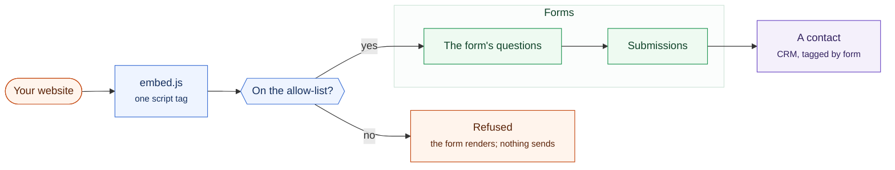

# Forms

Build a form, put it on your website, and what people send arrives as a contact
or an enquiry rather than as an email you have to retype.

Forms live inside the CRM, at **CRM → Forms**. What they collect ends up there,
so that is where they are set up.

A form on somebody else's website, and the one gate that decides whether it
is allowed to be there.

## Building one

Add fields — text, email, phone, number, web address, date, longer text, and
two kinds of choice — and mark which of them are required. A field that is not
required says **Optional** beside its label, rather than every required one
carrying a star: where four fields of five are required, marking the exception
is less ink and tells the visitor more.

A **date** field uses the visitor's own device picker, so on a phone it
behaves the way they already expect.

### Two kinds of choice

Both hold the same list of answers. Which one to use is a real decision, and
it is yours:

| | Use it when |
|---|---|
| **Choice (dropdown)** | The list is long. Thirty countries want a dropdown. |
| **Choice (all shown)** | The list is short and the answer matters. Four options a visitor ought to read before answering want to be on the screen. |

It matters most on a form where the answer routes the enquiry — sales here,
support there. A dropdown opens onto a list, and somebody in a hurry closes it
again having taken the first item; the message then goes to the wrong desk and
nobody finds out. Four boxes on the screen get read.

**Choice (all shown)** draws its options as cards rather than a column of small
dots, so the whole box is the target and not the thirteen pixels of the dot —
which matters on a form people fill in with a thumb. Nothing is preselected,
deliberately: a group with a default is a question the visitor never answers.

### Two fields on one row

Any field can be marked **half width**, and two of them then share a row — the
way a name sits beside an email on every good form. Existing forms are
unaffected, since nothing in them is marked.

The row collapses back to one column on a narrow screen, which is narrower
than a phone and about the width somebody drops a form into a sidebar at.

Each form has its own settings for what happens on submission: where the person
is sent afterwards, and who is notified.

## Putting it on your site

Each form gives you a snippet to paste into your website. It works on any site,
including ones that are nothing to do with Sentrello.

## What arrives

A submission can create a contact, or attach itself to one that already exists
when the email address matches. Somebody who fills in two forms is then one
person rather than two records sharing an address.

Submissions are listed with what was sent and when, and they export as a
spreadsheet. The columns come from the form's own questions, not from whatever
the first submission happened to answer. A question added last week is still a
column. Answers to a question you have since deleted are still in the file.

## Spam

Forms carry basic protection against automated submission. A form that is being
abused can be paused rather than deleted, which keeps the address valid and
leaves the submissions you already have where they are.
