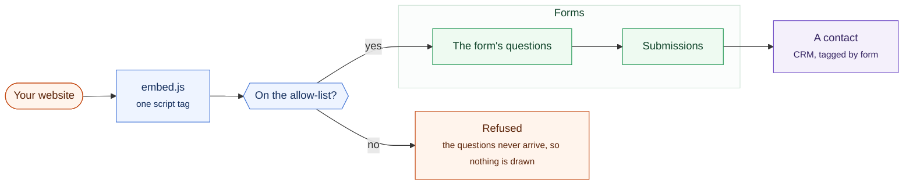

# Forms

Build a form, put it on your website, and what people send arrives as a contact
or an enquiry rather than as an email you have to retype.

Forms live inside the CRM, at **CRM → Forms**. What they collect ends up there,
so that is where they are set up.

A form on somebody else's website, and the one gate that decides whether it
is allowed to be there.

```mermaid
flowchart LR
  classDef screen fill:#eef4ff,stroke:#3b6fd4,color:#16305e
  classDef own fill:#eefaf1,stroke:#219653,color:#10442a
  classDef out fill:#f4f0fb,stroke:#6b47c4,color:#31205e
  classDef pub fill:#fff4ec,stroke:#c4470f,color:#5a2207
  SITE(["Your website"]):::pub
  EMB["embed.js<br/><small>one script tag</small>"]:::screen
  ALLOW{{"On the allow-list?"}}:::screen
  subgraph OWN[" Forms "]
    DEF["The form's questions"]:::own
    SUBM["Submissions"]:::own
  end
  CT["A contact<br/><small>CRM, tagged by form</small>"]:::out

  SITE --> EMB --> ALLOW
  ALLOW -->|"no"| X["Refused<br/><small>the questions never arrive, so nothing is drawn</small>"]:::pub
  ALLOW -->|"yes"| DEF --> SUBM --> CT
  style OWN fill:#fbfdfc,stroke:#cfe4d8,color:#10442a
```

## Building one

Add fields — text, email, phone, number, web address, date, longer text, and
two kinds of choice — and mark which of them are required. A field that is not
required says **Optional** beside its label, rather than every required one
carrying a star: where four fields of five are required, marking the exception
is less ink and tells the visitor more.

A **date** field uses the visitor's own device picker, so on a phone it
behaves the way they already expect.

### Two kinds of choice

Both hold the same list of answers. Which one to use is a real decision, and
it is yours:

| | Use it when |
|---|---|
| **Choice (dropdown)** | The list is long. Thirty countries want a dropdown. |
| **Choice (all shown)** | The list is short and the answer matters. Four options a visitor ought to read before answering want to be on the screen. |

It matters most on a form where the answer routes the enquiry — sales here,
support there. A dropdown opens onto a list, and somebody in a hurry closes it
again having taken the first item; the message then goes to the wrong desk and
nobody finds out. Four boxes on the screen get read.

**Choice (all shown)** draws its options as cards rather than a column of small
dots, so the whole box is the target and not the thirteen pixels of the dot —
which matters on a form people fill in with a thumb. Nothing is preselected,
deliberately: a group with a default is a question the visitor never answers.

### Two fields on one row

Any field can be marked **half width**, and two of them then share a row — the
way a name sits beside an email on every good form. Existing forms are
unaffected, since nothing in them is marked.

The row collapses back to one column on a narrow screen, which is narrower
than a phone and about the width somebody drops a form into a sidebar at.

Each form has its own settings for what happens on submission: where the person
is sent afterwards, and who is notified.

## Putting it on your site

Each form gives you a snippet to paste into your website. It works on any site,
including ones that are nothing to do with Sentrello.

**Name the sites it may be posted from.** The key in that snippet is visible in
anybody's page source, so the list of allowed sites is what makes it worth
having: a form with a list takes submissions from those places and nowhere else,
including from something that is not a browser at all.

**An empty list is not a closed door.** It turns away another website — a browser
says where it is posting from, and a site that is not on the list is refused —
but it accepts anything that names no site at all, which is what a script or a
server posting directly does. That is deliberate, because an empty list is also
how your own pages and your own integrations post, and there is no way to tell
those apart from a stranger's script. So the list is the control, and leaving it
empty leaves the form open to anything that is not a browser.

Name the sites before you paste the snippet.

## What arrives

A submission can create a contact, or attach itself to one that already exists
when the email address matches. Somebody who fills in two forms is then one
person rather than two records sharing an address.

Submissions are listed with what was sent and when, and they export as a
spreadsheet. The columns come from the form's own questions, not from whatever
the first submission happened to answer. A question added last week is still a
column. Answers to a question you have since deleted are still in the file.

**You can throw one away.** Press Delete on the row and the submission goes —
and so does any file it carried, which matters when the file is somebody's CV.
It asks first, because it cannot be undone. Anyone already added to the pipeline
stays there: they are a person in your CRM now, with a history of their own,
rather than an attachment of the form they arrived through.

Before this, the only way to remove a submission was to delete the whole form,
which takes every submission with it. That is the wrong instrument for the case
that actually comes up — a filled role on a careers form that is still taking
applications for the next one.

## Spam

Forms carry basic protection against automated submission: a field a person
never sees and a robot fills in, a limit on how fast one address may post, and
the allowed-sites list — which only counts for anything once you have filled it
in, as above.

Nothing counts what any of them turned away. A blocked submission is answered
and forgotten — writing down every robot that found a public form would be a
table that grows forever and tells nobody anything.

**A form that is being abused can be paused rather than deleted**, from the row
menu on the forms list. The tag stays on the customer's website, the address
stays valid, the submissions you already have stay where they are, and the form
simply stops taking anything. The list says *paused* beside its name, because
otherwise the only symptom is submissions quietly stopping. Press it again to
start taking them.
