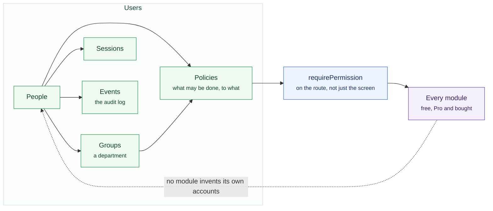

# Users and access

Every module uses these accounts. Nothing in Sentrello keeps a separate list of
logins, so connect a new module and your existing colleagues can use it
straight away, with the access they already have.

**Users** is its own section in the sidebar, with eight screens: People,
Groups, Policies, Sessions, Authentication, Providers, Events and API keys.


The **Customer** row is the one worth looking at twice. It is how you hand
somebody outside the business a login without handing them the business: it
opens the dashboard and nothing else.

Their invoices do not come through a login at all. A customer follows the
link you send them, and that link is the whole credential — no account, no
password, and nothing to widen, because there is no role behind it to
widen. It shows that customer's own documents and there is no address that
shows anybody else's.

One set of accounts, and two questions asked about every request.



## People

**Users → People** lists everybody with access. Invite somebody by email; they
set their own password from the link. Nobody types a password for somebody
else.

Open a person and you get their whole record: their details, their
credentials, what they can actually do, which groups they are in, the devices
they are signed in on, and everything that has happened to their account.

An invitation that is never accepted expires.

## Somebody who leaves

**Suspend** an account instead of removing it. Sign-in stops immediately and
every session they have open ends, while the invoices they raised and the notes
they wrote keep their author. Remove them and that history goes with them.

Two things are refused, on purpose: you cannot suspend yourself, and you
cannot suspend or remove the last administrator. An instance with no
administrator cannot be recovered from the browser at all.

## What somebody can actually do

The **Access** tab on a person answers that question directly, resource by
resource. For each thing they may do, it also names **where that came from**.

That matters more than it sounds. Somebody can hold the same permission twice,
once from their own policy and once through a group. Take them out of the group
and nothing changes, because the other route is still open. A screen showing
only one of the two would have you remove the wrong thing.

A resource nobody granted is shown saying so rather than being left out, so
"why can't they do that" has an answer on the same screen.

## Policies and groups

What somebody can do is decided by the **policies** attached to them. A policy
grants specific permissions on specific modules: read invoices, create
contacts, update settings.

Nine are set up for you, in two kinds, and the screen shows them as two tables.

The first five say **how senior somebody is**, and are given to a person
directly:

| Policy | Roughly |
|---|---|
| **Admins** | Everything, including settings and other people's access |
| **Executives** | Everything operational; reads the money screens |
| **Managers** | Their team's work, and the customers behind it |
| **Staff** | Day-to-day work; no settings, no books |
| **Customers** | Signs in and sees the dashboard. Their own documents come through a link, not a login |

The other four say **what department somebody is in**, and are carried by a
group rather than handed out one at a time:

| Policy | Roughly |
|---|---|
| **Sales** | The pipeline, the people in it, and quotes |
| **Marketing** | Campaigns, forms and links — but not the domain they point at, which is an act with DNS behind it |
| **Accounting** | The books in full, and read on the CRM, because an unpaid invoice is a conversation with a person |
| **Customer service** | The diary in full and orders they can change, because moving an appointment is the commonest thing anybody rings about |

**Groups** are how the second kind reaches people: Sales, Marketing, Accounting,
Customer Service. A new joiner gets the right access by being put in the right
group, rather than by somebody remembering fourteen switches. A group has its
own Access tab, which answers the same question about the policies it carries.

Two more groups arrive with them — **Admins** and **Customers** — which are
a group *and* a policy of the same name. A business puts its owners in a
group and hands the same access to one person directly, and two things
meaning the same would be two places to edit it. Six groups in all.

Every one of these is yours to change, copy or delete. They are data, not
something compiled into the product.

## Signing in

**Users → Authentication** holds the rules.

### With a Google account

Optional, and off until you switch it on. With it on, people use the Google
account they already have instead of remembering another password.

Create an OAuth client in the Google Cloud console, paste its client ID and
secret into **Users → Authentication**, and give Google the redirect URI the
screen shows you — it refuses anything it was not told about in advance. The
details are checked against Google before they are stored, so wrong ones are
refused here rather than at the moment somebody tries to sign in. The secret
is sealed and never shown again.

**Restart the instance afterwards.** Which sign-in methods exist is decided
when the server starts, so the button appears at the next `docker compose up
-d` rather than immediately. Disconnecting works the same way, and nobody
loses their account: people who signed up through Google keep it.

**Two-factor authentication** can be turned on by anybody from their own
profile, and required by policy. Per role, that is, rather than for everybody:
the person who can move money is not the person clocking in on a shared
tablet, and a business forced to require both will require neither. Recovery
codes are shown once, at the moment it is enabled.

Required means refused. Somebody holding a named role and no second factor is
told so on their profile and turned away from everything else until they set
one up.

Four things stay reachable, and they are the way back: their own profile and
its security panel, where a second factor is set up; the policy screen, so an
administrator who named their own role by mistake can unname it; and the
compliance settings, where the stricter rule that requires one of everybody is
switched off again. Each still needs a password and the permission for it —
this is an administrator, not the public. Nobody can lock the business out of
undoing it.

:::warning[Recovery codes are shown once]
Store them somewhere other than the machine you sign in from. Losing both the
device and the codes means an administrator has to reset the account.
:::

:::warning[Keep the server's clock right, or nobody gets in]
An authenticator code is a number derived from the time, worked out twice —
once on the phone, once on your server — and the two have to agree to within
about half a minute. So a server whose clock has drifted refuses **everybody's**
code at once, and the screen says the code was not accepted, because from where
it is standing that is what happened.

Any Linux host keeps its clock right on its own as long as the time service is
running. On Rocky, AlmaLinux and RHEL that is `chronyd`:

```bash
timedatectl                  # "System clock synchronized: yes" is what you want
sudo systemctl enable --now chronyd
```

A virtual machine that has been suspended and resumed is the usual culprit, and
a container inherits its host's clock rather than keeping one of its own — so
this is fixed on the machine, never inside Sentrello.
:::

**Email addresses can be required to be confirmed** before their owner can
sign in. It is off by default, and it cannot be switched on until you have
configured email; otherwise nobody could confirm an address, yourself included.
Switching it back off is always allowed. Your own address counts as confirmed
from the moment you claim the instance, since you read the setup token off the
server, and that proves rather more than a link in an inbox does.

**How long somebody stays signed in** is thirty minutes of inactivity unless
you say otherwise, and you can say up to thirty days. Half an hour is the
right default for software holding a business's books and the wrong thing to
impose on somebody working alone on their own laptop. The clock is idle time,
not total time: it resets every time you do something, so a day's work is one
sign-in however long the day is.

**The shortest password this business will accept** starts at twelve
characters and can be raised, not lowered — twelve is what NIST asks of a
password standing on its own, and it is not a business's to waive. Whatever
you set applies everywhere a password is chosen: creating an account, changing
your own, and setting one from a reset link. A rule enforced on one screen is
a rule the API does not have.

**Repeated wrong passwords lock an address.** Five in a row by default, for
fifteen minutes. The lock lifts itself. An administrator can clear it from the
person's Credentials tab, and issuing a new password clears it too. Set the
attempt count to zero to turn locking off entirely.

If the locked-out person is your only administrator, there is a way back in
from the server itself that needs no sign-in first. See
**Running it → When something is wrong**, which covers the password and the
lock both.

That screen also tells you two things about your own deployment that stay
invisible until they bite: which header your proxy uses for a visitor's real
address, and whether your address is `https`. Get the header wrong and every
sign-in appears to come from the same place, which means one person guessing
passwords locks out everybody.

## Sessions

**Users → Sessions** shows every device signed in across the business, who it
belongs to and when it was last used. Sign out one, or all of them. A person's
own record has the same list for just them.

## What has happened

**Users → Events** is the audit log: who did what, to whom, and when.
Administrative actions are recorded (invitations, role changes, suspensions,
password resets, group membership) along with sign-in attempts, successful and
failed.

Search it by person, by kind of action, or by a window of time. It is also
what the lock is worked out from, rather than a separate counter that could
disagree with it.

Old entries are pruned to whatever you choose to keep, a year by default. The
prune records itself, because history that could vanish without a trace would
not be much of an audit log.

## API keys

Some things that call Sentrello are not people. A script that posts usage every
night, an export that runs before anybody is in: you don't want to give either of
them a person's login, and you don't want a password sitting in a cron job.

**Users → API keys** makes a key for one of them. Give it a name, tick what it
may do, and optionally pick the last day it works. The key is shown once, when
you make it. We keep a fingerprint of it rather than the key itself, so a lost
key is replaced, not recovered. The list shows the first few characters of each
key, who made it, and when it was last used, which is what you check before
revoking one.

A script sends it on every request:

```bash
curl https://your-instance/api/... \
  -H "Authorization: Bearer sntl_..."
```

A key can never do more than you can:

- **You can only tick what you hold yourself.** Ask for a permission you
  don't have and the key isn't made.
- **It shrinks with you.** Every call checks the key's own list *and* your access
  as it stands that day. If your role changes, or you're suspended or removed,
  your keys lose that access with you.
- **It only calls routes that name a permission.** The routes that act on
  whoever is signed in, like your own profile and security settings, turn
  keys away.
- **It can't make or revoke keys**, even with `settings:update` on it.

Revoking a key, or reaching the end of the day it was set to work until, stops
it at once. "The end of the day" means the end of that day where your business
is. Too many wrong keys from one address and that address is refused for a
while. Making and revoking keys both appear in **Users → Events**.

## How permissions are enforced

Twice, deliberately.

A module only loads if the license entitles it. Every route inside it then
checks the permission again before doing anything. A screen showing or hiding a
button is a convenience rather than the enforcement: a request made straight to
the API is checked exactly the same way.
