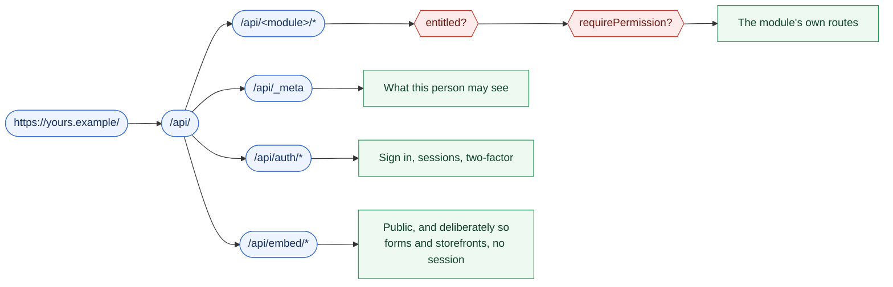

# The API

## The stack

One Hono application on Bun, over PostgreSQL 17 through Drizzle ORM, serves
every route: free and paid, core and module alike. Sessions come from Better
Auth, with email and password, optionally Google, and roles scoped to an
organisation. Background jobs run in pg-boss, inside Postgres itself, so there
is no Redis to operate.

## How a route is guarded

Every path under `/api/` meets the same two gates, in the same order. The
module decides what the route does; the host decides whether it exists and
whether you may call it.

`/api/embed/` is the one branch that skips both gates, and it is meant to: an
embedded form on somebody's public website has no session to check and no
permission to hold. It is scoped by the form's own key and its allow-list
instead.

A request passes a session check and a permission check before any handler
runs. Every query is scoped to an organisation at the data layer, rather than
left to each page to remember.

Paid features are gated twice more, and the two gates answer differently on
purpose:

| Gate | When it refuses | What the caller sees |
|---|---|---|
| Entitlement | The licence does not cover the module | **404** — the route genuinely does not exist |
| Permission | The account may not do this | **403** |

A 404 rather than a 403 for an unentitled feature is deliberate: a module the
licence does not cover is never registered at all, so there is nothing to
forbid. It also means an instance does not enumerate what its owner has not
bought.

## Where the reference stands

There is no published API reference yet. The platform is still moving ahead of
v1, and endpoints published today would change under anybody who relied on
them. So this page describes what exists without listing routes.

Until the reference lands, the source is the reference. Every endpoint in the
free core is readable in
[the public repository](https://github.com/Sentrello/Sentrello), registered
through the same `defineModule` contract described in
[Extending Sentrello](/platform/extensible).
