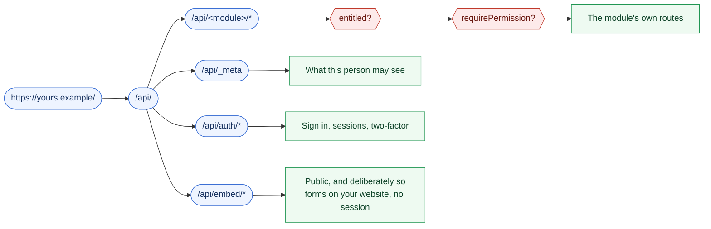

# The API

## The stack

One Hono application on Bun, over PostgreSQL 17 through Drizzle ORM, serves
every route: free and paid, core and module alike. Sessions come from Better
Auth, with email and password, optionally Google, and roles scoped to an
organization. Background jobs run in pg-boss, inside Postgres itself, so there
is no Redis to operate.

## How a route is guarded

Every path under `/api/` meets the same two gates, in the same order. The
module decides what the route does; the host decides whether it exists and
whether you may call it.


```mermaid
flowchart LR
  classDef url fill:#eef4ff,stroke:#3b6fd4,color:#16305e
  classDef gate fill:#fdeaea,stroke:#c0392b,color:#6b1a12
  classDef leaf fill:#eefaf1,stroke:#219653,color:#10442a

  ROOT(["https://yours.example/"]):::url
  API(["/api/"]):::url
  META(["/api/_meta"]):::url
  AUTHP(["/api/auth/*"]):::url
  MOD(["/api/&lt;module&gt;/*"]):::url
  EMBED(["/api/embed/*"]):::url

  ENT{{"entitled?"}}:::gate
  PERM{{"requirePermission?"}}:::gate

  NAV["What this person may see"]:::leaf
  SESSION["Sign in, sessions, two-factor"]:::leaf
  WORK["The module's own routes"]:::leaf
  PUBLIC["Public, and deliberately so<br/>forms on your website, no session"]:::leaf

  ROOT --> API
  API --> META --> NAV
  API --> AUTHP --> SESSION
  API --> MOD --> ENT --> PERM --> WORK
  API --> EMBED --> PUBLIC
```

A handful of branches skip both gates, and each one is meant to. `/api/embed/`
is the one most people meet: an embedded form on somebody's public website has
no session to check and no permission to hold, so it is scoped by the form's own
key and the list of sites the business allowed. Beside it, in the free core,
inbound mail from a provider carries a secret in its address, and a card
processor reporting that money moved is authenticated by a signature over the
raw body. A customer's own portal, a shared invoice and a shared quote are
reached by a token that is the whole credential.

Add a paid module and that list grows: a storefront, a booking page, a
subscribe form, a short link, a shared file, a receipt from a till. Every one
of them is written down in a test that enumerates the routes answering a
stranger and fails the build on a new one — so the list is complete by
machine rather than by memory, and a reviewer argues with an entry instead of
rediscovering a route.

A request passes a session check and a permission check before any handler
runs. Every business table carries an organization and every query filters on
it. Two tests hold that rule, so it is checked by a machine rather than
remembered by a person. One watches the SQL each free-core route sends and fails
the build on a read that leaves the organization out. The other puts a marked
record in a second business and fails if it ever turns up in the first.

To be exact about the mechanism, because "at the data layer" gets read as
database row-level security and this is not that: the filter is in the query,
and what makes it reliable is that every query passes through one database
client, where the test can see it.

Paid features are gated twice more, and the two gates answer differently on
purpose:

| Gate | When it refuses | What the caller sees |
|---|---|---|
| Entitlement | The license does not cover the module | **404** — the route genuinely does not exist |
| Permission | The account may not do this | **403** |

A 404 rather than a 403 for an unentitled feature is deliberate: a module the
license does not cover is never registered at all, so there is nothing to
forbid. It also means an instance does not enumerate what its owner has not
bought.

## Calling it from a script

A script has no browser and nobody to sign in. Give it an API key instead: an
administrator makes one under **Users → API keys**, ticks the permissions it
needs, and the script sends it with every request.

```bash
curl https://your-instance/api/users/groups \
  -H "Authorization: Bearer sntl_..."
```

The key goes through the same two checks a person does. Where a person's
access comes from their policies, a key's is its own list, and that list can
never hold more than the person who made it. Both are checked on every call, so
when the maker loses access, the key loses it too. A key that has been revoked,
has passed its last day, or was never real gets a **401**. A key without the
permission a route asks for gets a **403**, exactly as a person would. So does
a key calling a route that names no permission at all, like the ones that act
on your own profile, because those are about a person and a key isn't one.
For the same reason a key can't make keys, issue a password, invite anybody or
connect single sign-on, whatever its list says.

Cookie sign-in is unchanged by any of this. A browser never adds an
`Authorization` header by itself, so another website can't make your browser
send a key. And a request that carries a key is judged on the key alone, even
if a session cookie came with it.

## Where the reference stands

There is no published API reference yet. Routes still change between releases,
and a reference published today would break under anybody who relied on it. So
this page describes what exists without listing routes.

Until the reference lands, the source is the reference. Every endpoint in the
free core is readable in
[the public repository](https://github.com/Sentrello/Sentrello), registered
through the same `defineModule` contract described in
[Extending Sentrello](/platform/extensible).
