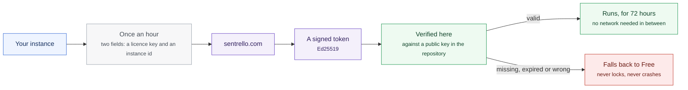

# Security

## Where the data lives

The database runs on your own server. Customer records, invoices, ledger
entries and user logs never leave the instance.

A free instance never has to contact Sentrello at all. A paid instance sends
one licence check an hour. That check carries a licence key and an instance id,
and nothing else.

One module can be told to send more, and only if you ask it to. Choose SEO
Cloud over a provider account of your own and the domains and keywords you
research reach Sentrello under your licence key. Every other module runs with
nothing leaving the instance.

## The licence check

| | |
|---|---|
| How often | Once an hour, on a paid instance only |
| What it sends | A licence key and an instance id |
| How it is verified | Offline, against a public key in the repository |
| How long a result lasts | 72 hours |
| If it fails | The instance degrades to Free |

Hourly rather than nightly for one reason: a verified token stays valid for 72
hours, so an hourly call is what makes a cancelled licence stop promptly
instead of up to three days later.

Verification needs no internet. The token is signed with Ed25519 and checked
against a public key embedded in the public repository. An instance that cannot
reach sentrello.com keeps working on the token it already holds.

## Licensing fails soft

A missing, expired or invalid token degrades the instance to Free. Nothing
locks. Nothing breaks. No data is held hostage. You keep the dashboard, CRM,
invoicing and bookkeeping described in
[Open source](/platform/open-source); the paid modules stop being loaded.

This is the behaviour to rely on if you are evaluating what happens to your
business when a supplier disappears. The failure mode is a smaller Sentrello,
not a stopped one.

## The operational boundary

- The installer generates the instance's own database password and signing
  secrets. Nothing ships with a default.
- TLS terminates at a reverse proxy on **your** certificate, not one issued or
  held by Sentrello.
- Every update takes a database backup before it starts, and refuses to
  continue without one.
- Sign-up is closed by default. A fresh instance is claimed once, using a setup
  token from the server's own `.env` file.
- Roles, two-factor authentication and a per-account device list limit what each
  login can do.

Because pricing is per instance rather than per seat, giving every employee an
account of their own costs nothing. That matters more than it sounds: an audit
trail only means something when nobody is sharing a login.

## Reporting a vulnerability

Email [security@sentrello.com](mailto:security@sentrello.com) with what you
found and how to reproduce it. Please do not open a public issue for a
vulnerability report.

Everything asserted on this page about the free core is implemented in code
that is public under the AGPLv3, so each statement can be checked rather than
taken on trust.
