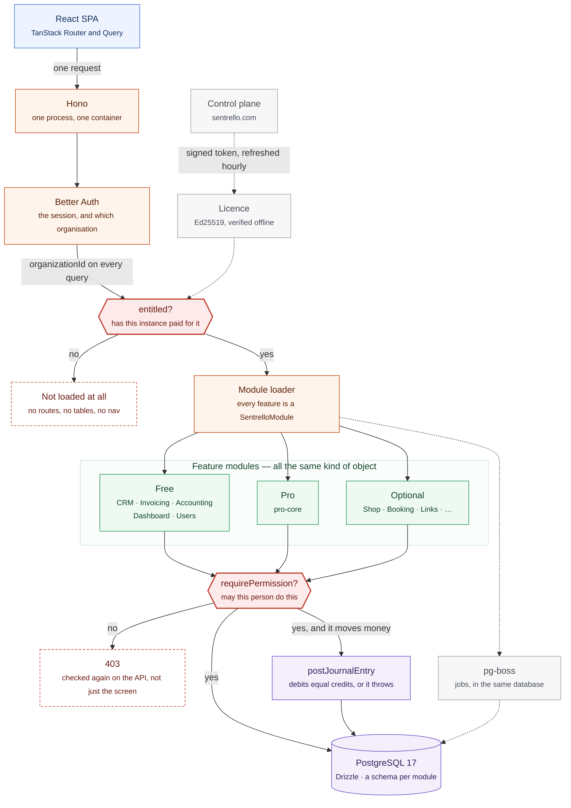

# Architecture

One deployable service. It discovers its feature modules at startup, decides
which of them this instance is allowed to load, and then checks every request
against the person making it. Below is the whole of it on one page.

Read it top to bottom. That is the order a request meets things.

## The two gates are not the same gate

They sit next to each other above on purpose, and confusing them is the most
common misreading of this diagram.

**`entitled()` asks about the instance.** Has this business paid for the tier,
or bought this module? A module that fails it is never loaded at all — its
routes do not exist, its tables are not migrated, and nothing in the interface
refers to it.

**`requirePermission()` asks about the person.** May *this* user do *this*
thing to *this* resource? It runs on every route inside a module that was
loaded.

Passing one says nothing about the other. A fully licensed instance still
refuses a member of staff who tries to open the ledger, and an administrator
with every permission in the product still cannot open a module nobody bought.

A screen that shows or hides a button is a convenience on top of both. The
same request made straight to the API is checked exactly the same way.

## What the browser is told

The interface does not know what exists. It asks `/api/_meta` and is told what
this person, on this instance, may see — and it draws that. Which means the
nav is a *result* of the two gates rather than a list maintained beside them.

## What never leaves your server

The licence is verified **offline**, against a public key compiled into the
build. The control plane signs tokens; it is not asked for permission at
request time, and an instance with no route to the internet keeps working.

A missing, expired or invalid token fails safe to Free. It never crashes the
application, and it never quietly opens something.

## Where the state lives

One database. A schema per module, and every business table carries an
`organizationId` — the scoping lives in the data layer rather than in each
page's good intentions, which is the difference between a rule and a habit.

Jobs run through pg-boss, in that same PostgreSQL. No Redis, no second thing to
back up, no second thing to be down.

**Every financial event goes through `postJournalEntry`**, which throws unless
the debits equal the credits. The ledger is the source of truth for every
report, and nothing writes money to the database around it.

## Why one service

A business with nine people has no operations team. One container to run, one
database to back up, one process to restart. Modules are discovered rather than
deployed separately, so buying one is a licence change rather than an
infrastructure change.

See [Extending Sentrello](/platform/extensible) for the contract each module
implements, and [Security](/platform/security) for what the gates above are
enforcing.
