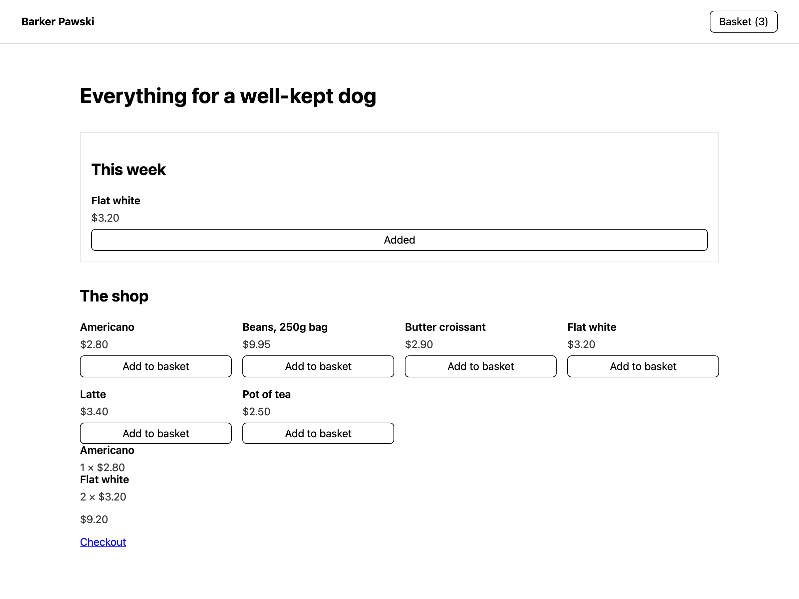

# Shop on your own website

The Shop module is **headless**. Your instance holds the products, the stock, the
orders and the money; your website is whatever you already have — Astro, Next.js,
Nuxt, SvelteKit, WordPress, or a hand-written HTML file.

One script tag, and four HTML tags you can put anywhere.



*That page is a plain HTML file on a different domain from the instance.*

## Two things to set up

**1. Add your website's domain to the shop.** Shop → Settings → the list of sites
allowed to use this shop. Until a domain is listed, the browser refuses every
request from it — which is the point: your products, prices and baskets are only
readable by the sites you name.

Subdomains can be covered at once with `*.example.com`. Your instance's own
address is always allowed, so the built-in storefront needs nothing.

**2. Put the script on your pages.**

```html
<script src="https://sentrello.yourbusiness.com/shop/embed.js" defer></script>
```

That is the whole installation. The address of your instance is baked into the
file, so nothing needs configuring on the page.

## The four tags

### A basket in the header

```html
<sentrello-shop-cart-button label="Basket"></sentrello-shop-cart-button>
```

Shows the count and goes to the checkout. Put it in your header partial, in every
layout — it defines itself once however many times the script is included.

### A grid of products

```html
<sentrello-shop-products limit="6"></sentrello-shop-products>
<sentrello-shop-products category="beans"></sentrello-shop-products>
<sentrello-shop-products collection="gifts" currency="GBP"></sentrello-shop-products>
```

| Attribute | What it does |
|---|---|
| `limit` | How many to show |
| `category` | Only this category |
| `collection` | Only this collection |
| `currency` | Prices in this currency, if the shop sells in several |

### One product, anywhere

```html
<sentrello-shop-product slug="beeswax-candle"></sentrello-shop-product>
```

The featured-product block: drop it into a page, a sidebar, a blog post about the
thing it sells.

### The basket itself

```html
<sentrello-shop-cart></sentrello-shop-cart>
```

Lines, total, and a link to the checkout. Adding the same thing twice makes it a
quantity of two rather than a second line.

## How it looks

Every tag renders inside a **shadow root**, which means your site's CSS cannot
accidentally break it and it cannot accidentally break your site. It inherits
your font and your text colour deliberately, so it looks like part of the page
rather than an iframe someone dropped in.

If you want it to look like something else entirely, build your own — see
[Building your own](#building-your-own) below.

## Frameworks

**These are standard custom elements, so every framework already supports them.**
There is no Sentrello package to install and no wrapper to keep up to date.

**Astro, Eleventy, WordPress, plain HTML** — the script tag and the tags. Nothing
else.

**React (19 and later)** — write the tags directly in JSX:

```jsx
export function Shop() {
  return <sentrello-shop-products limit="6" />;
}
```

React 19 passes unknown attributes through to custom elements. On React 18 and
earlier, attributes still work — it is properties that do not, and none of these
tags take properties.

**Vue** — tell it which tags are not Vue components:

```js
// vite.config.js
vue({ template: { compilerOptions: {
  isCustomElement: (tag) => tag.startsWith("sentrello-"),
} } })
```

**Svelte and SolidJS** — the tags work as written.

**Next.js and other server-rendered frameworks** — the tags render as empty
elements on the server and fill in on the client. If you need the products in the
HTML for search engines, fetch them on the server from the API and render your
own markup; see below.

## Building your own

The script leaves a small surface on `window` for sites that want their own
look entirely:

```js
SentrelloShop.products("limit=4").then((data) => {
  // data.products — name, slug, image, variants with prices
});

SentrelloShop.cart.add(variantId, 1);
SentrelloShop.cart.load();
SentrelloShop.money(320); // "$3.20"
```

The basket announces itself whenever it changes, so a header you wrote yourself
can follow along:

```js
window.addEventListener("sentrello-shop:cart", (e) => {
  render(e.detail); // the basket, or null when it has gone
});
```

## The API directly

Everything the tags do is a public, read-only API you can call from a server:

| Endpoint | What it gives |
|---|---|
| `GET /api/shop/storefront/shop` | The shop's name, currency and settings |
| `GET /api/shop/storefront/products` | Published products, with prices |
| `GET /api/shop/storefront/products/:slug` | One product |
| `POST /api/shop/storefront/checkout` | Start or change a basket |

**Prices and availability, never counts.** The API says whether something can be
bought, not how many are left — a number in stock on a public page tells a
competitor what you turn over.

Calls from a browser need the domain listed (above). Calls from your own server
have no origin and are not restricted, which is what makes server-side rendering
possible.

## When something does not work

**"Blocked by CORS policy"** — the domain is not listed in Shop → Settings. That
is nearly always it. A 404 from the API is *not* reported this way: a product
whose slug has a typo answers `no such product` in plain JSON, so the two
problems are told apart.

**The tags render as nothing** — the script did not load. Check the address in
the `src`, and that it is your instance rather than a copy of the file.

**Prices look wrong** — a shop selling in several currencies needs `currency` on
the tag, or it uses the shop's own.
