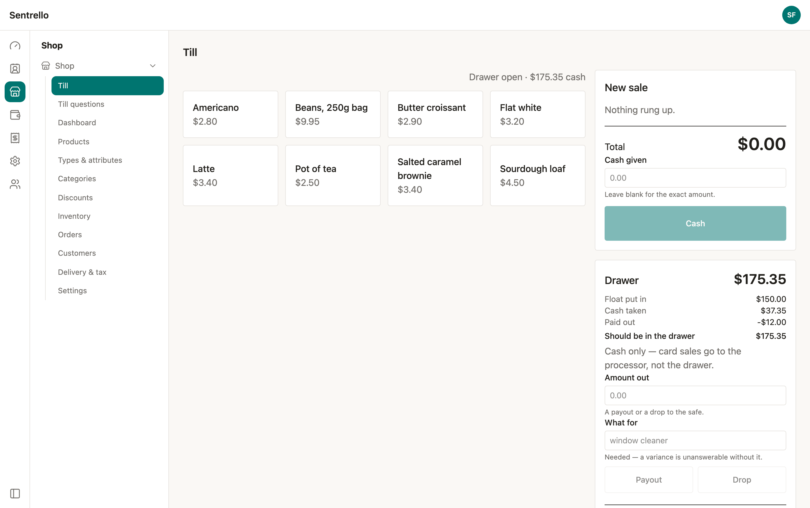
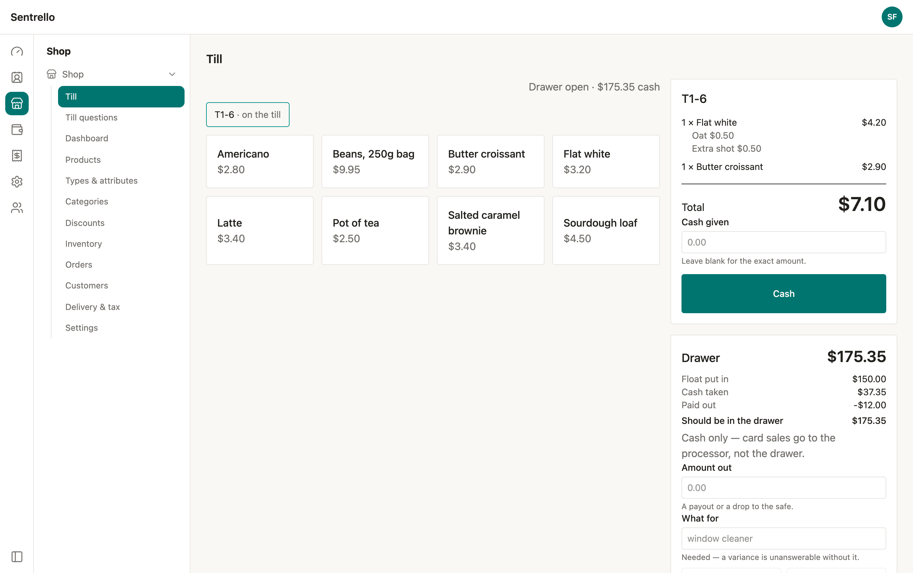
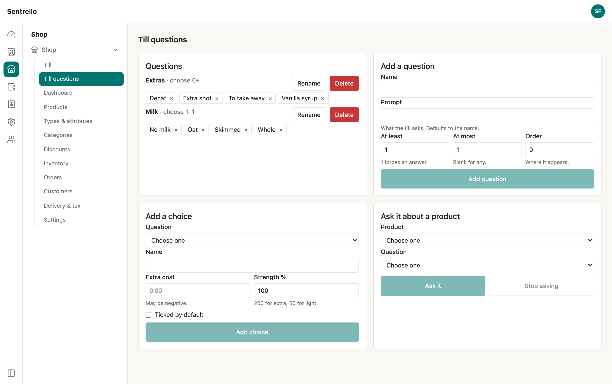
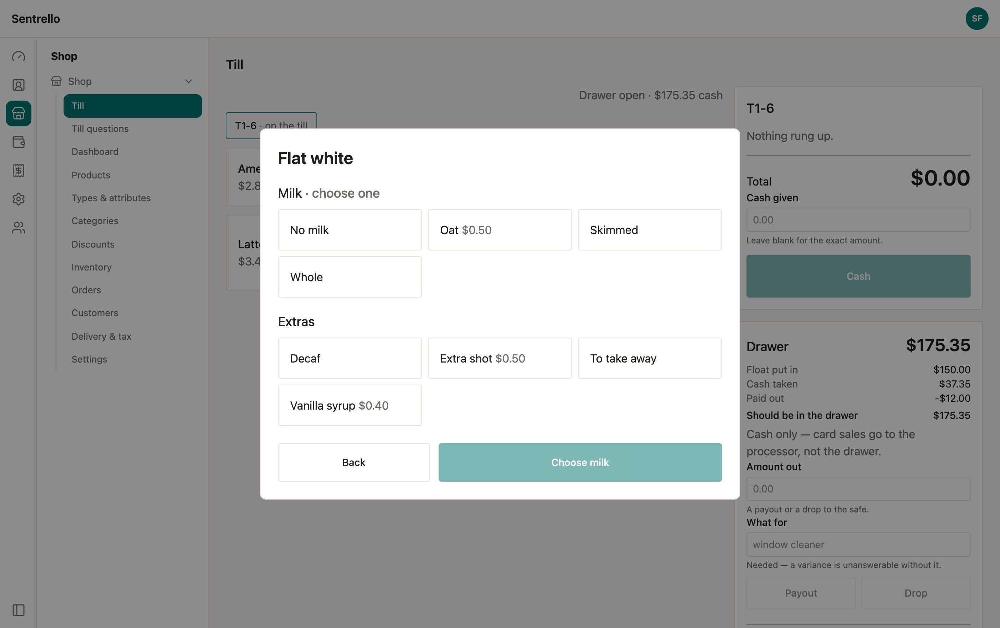
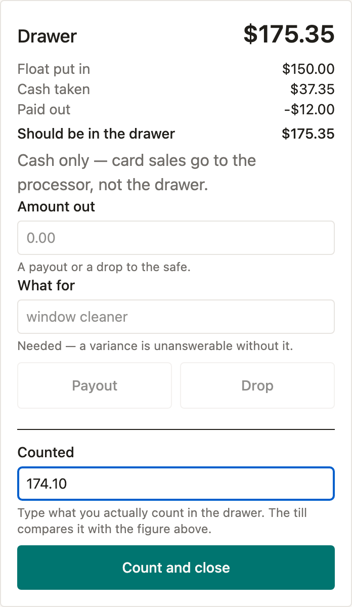
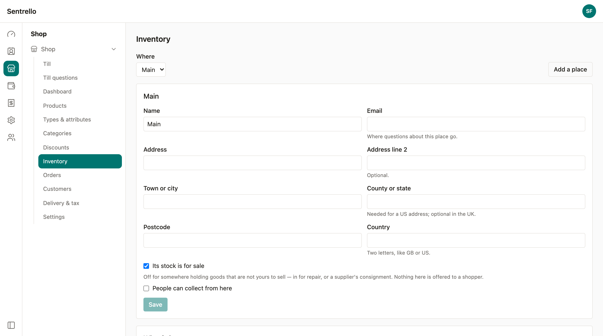

# Till

A point of sale for a counter. It sells the same products at the same prices as
your online shop, takes the stock off the same shelf, and posts the money to the
same books — so a business that sells both ways has one set of figures rather
than two that have to be reconciled on a Sunday evening.

**The Till needs the Shop module.** It is not a separate product with its own
catalogue; it is a second way of selling the one you already have.

## Before you start

Three things, in this order:

1. **Enable Shop and Till** under Settings → Modules.
2. **Add your products** under Shop → Products, and publish them. Anything not
   published does not appear on the till, on purpose: the till shows what is for
   sale, and a draft product is not.
3. **Set a price.** A product with no price cannot be rung up.

Stock is optional. A product with a stock count is limited by it; a product with
no count is sold without limit, which is right for a coffee made to order and
wrong for the last loaf on the shelf. See [Stock](#stock-what-a-counter-sale-does)
below.

## Ringing up a sale

Tap a product. It goes on the ticket on the right, and the total — the only
number a customer ever asks about — stays in the same place whatever else is
happening on the screen.

Tap the same product again and the line becomes a quantity of two rather than a
second row. That is what a second tap means at a counter.

Everything on the ticket is priced as the shop prices it. If you change a price
under Shop → Products, the till uses the new one immediately; there is no
separate menu to keep in step.

### More than one sale at once

A counter serves more than one person at a time. Tickets sit in a row above the
products — `T1-6`, `T1-7` — and tapping one brings it back. Take a coffee order,
start a second while the first is being made, come back and take the money.

A ticket stays open until it is paid for. Nothing expires it while somebody is
still standing there.

## Questions: milk, sizes, extras

A till that cannot ask "which milk?" sends a member of staff back to the counter
to ask. **Till questions** are the answer, set up under Shop → Till questions.

A question has:

| Field | What it does |
|---|---|
| **Name** | What the question is called — *Milk*, *Size*, *Extras* |
| **Prompt** | What the till actually asks. Defaults to the name |
| **At least** | `1` forces an answer. `0` makes it optional |
| **At most** | `1` for one answer only. Blank for any number |
| **Order** | Where it appears when a product asks several |

A choice has a name, an **extra cost** (which may be negative — a discount for
bringing your own cup), and a **strength**: 200% for *extra*, 50% for *light*.
The till prices a double shot of syrup at double, without you creating a second
choice for it.

Then **ask it about a product**. One question can be asked about many products —
*Milk* belongs on every coffee — and a product can be asked several.

### What it looks like at the counter

When a product has questions, the till asks them before the item goes on the
ticket. One at a time, in front of everything else.

**A required question cannot be skipped.** The button says what is still missing
— *Choose milk* — rather than letting somebody carry on and sending a half-made
order to whoever is making it. That is the whole reason the questions exist.

Choices with a price are added to the line and shown under it, so a receipt can
say 3.20 for the coffee and 0.50 for the oat milk rather than a single number
nobody can take apart.

**Two of the same drink made differently are two lines.** A flat white with oat
milk and a flat white without are not one line of two — they are made
differently, priced differently, and handed to different people.

## Taking the money

**Cash works today.** Type what the customer handed over and press Cash; the
till works out the change. Leave the box blank for the exact amount.

The sale then becomes a Shop order — the same order a website sale becomes, with
the same order number series, in the same list under Shop → Orders, posting the
same double-entry journal to the same accounts. There is no second path from a
sale to your books.

**Card is not here yet.** It needs a card reader, and the till says so plainly
rather than offering a button that cannot work. See
[What is not here yet](#what-is-not-here-yet).

## The drawer

The drawer is how a business knows its cash is right. It is optional: a business
that never opens one still sells things, and the till never holds up a sale over
bookkeeping nobody asked for.

**Open a drawer** at the start of a shift with the **float** — the money going
in to make change with.

Everything that moves is written down as it happens:

| Line | What it is |
|---|---|
| **Float put in** | What you started the shift with |
| **Cash taken** | Every cash sale on this drawer |
| **Paid out** | Money out for something that is not a sale |
| **Should be in the drawer** | The three above, added up |

**Money out needs a reason.** "Where did forty pounds go" is the question a
variance produces, and a note written at the time is the only answer anybody will
ever have. A **payout** is money spent — milk from the corner shop. A **drop** is
money moved to the safe.

**Counted** is the one figure the till does not know. Count the drawer, type what
is actually in it, and press *Count and close*. The difference is worked out and
written down against that shift, as it was at that moment.

A shortfall is reported as a shortfall. It is never rounded away or called
"within tolerance" — a figure that hides small differences is a figure everybody
learns to ignore, and then it is worth nothing on the night it is large.

### Why a card sale never reaches the drawer

Cash is the only money nobody else is keeping a record of. A card sale has a
processor's account behind it and a bank statement to reconcile against; a
twenty-pound note has a person and a box.

So the drawer counts notes, and the ledger's cash account counts takings of every
kind. Both figures are right and they answer different questions. Counting your
notes against your takings would compare a box against money still sitting at a
payment processor.

## Stock: what a counter sale does

A website order **claims** stock. The goods are still on the shelf — they are
there until somebody packs a parcel — so the count moves when the parcel does.

A counter has no parcel. The customer pays and walks out holding it, so a till
sale takes the goods off the shelf at the moment it is rung. The order is placed,
paid and fulfilled in one action.

This is why the Inventory screen has three numbers rather than one:

| Column | What it means |
|---|---|
| **On the shelf** | What is physically there, whoever it belongs to |
| **Claimed by orders** | Spoken for by orders not yet sent |
| **Free to sell** | What the till and the website may still sell |

**Free to sell is the number that decides whether a sale can happen.** Two loaves
on the shelf with two claimed means nought free — the loaves are there, and they
belong to somebody who has already paid for them. The till will refuse to sell
them, correctly.

Products with no stock count at all are never limited. A coffee is made when it
is ordered; there is no shelf to run out of.

## Who can use it

The till uses the same people, roles and permissions as the rest of Sentrello.
It never has its own logins.

| Permission | What it allows |
|---|---|
| `pos:read` | See the till and the drawer |
| `pos:sell` | Ring up sales, take cash, open and close a drawer |
| `pos:void` | Cancel a ticket |
| `pos:refund` | Give money back |
| `pos:manage` | Set up the questions the till asks |

Setting up questions is a manager's job, so it sits behind `pos:manage` rather
than being available to a counter shift. Everything a shift needs is `pos:sell`.

## What is not here yet

Said plainly, because a list of what a product cannot do is more useful than a
list of what it can.

- **Card payment at the counter.** It needs a reader, and a till that pretended
  otherwise would be a button that takes no money. Planned.
- **Working offline.** The server already accepts each change once however many
  times a terminal sends it, which is the hard half of selling through a dropped
  connection. The terminal half — holding the menu and the tickets on the device
  — is not built yet.
- **Table service, tabs, and kitchen printing.** The till is built for counter
  service first. The rest is planned through 2027.

## How it fits with everything else

- Every sale is a **Shop order**, in the same list, with the same numbering.
- Every sale posts a **balanced journal entry** through the same accounting the
  rest of Sentrello uses. Takings show up in the profit and loss without anybody
  typing them in.
- Stock is **one count**, shared with the website. You cannot sell the last one
  twice.
- People and permissions come from **Users**. A new starter gets till access the
  same way they get everything else.
