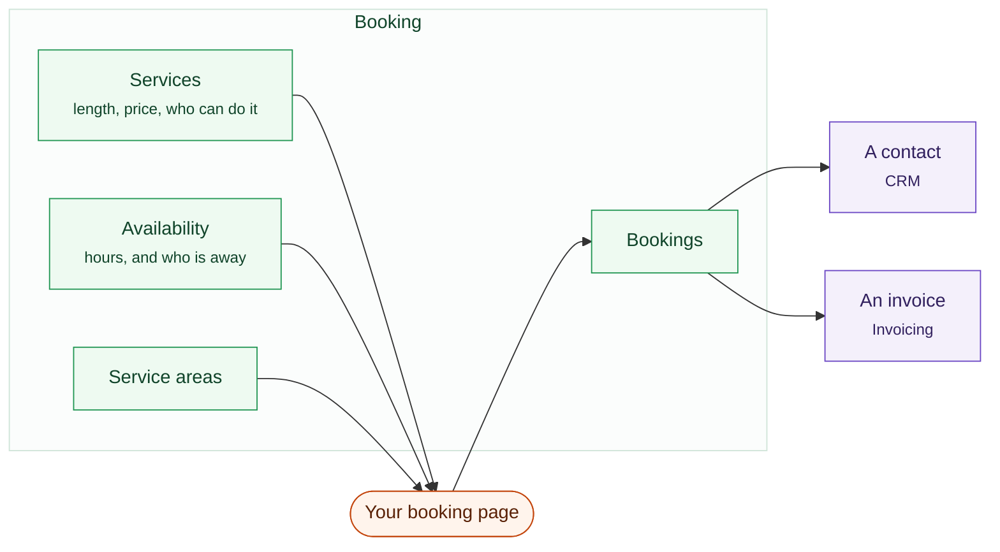
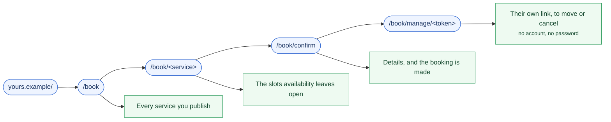

# Booking

A booking page your customers can use to take a slot themselves, and a diary
that stays honest about what is free.

What a booking touches, from the service you defined to the invoice it
becomes.

## Services

A **service** is something bookable: a consultation, a site visit, a treatment.
Each one has a duration and its own availability, plus a price if you charge
for it.

Duplicate a service when you offer the same thing at three lengths. Retire one
and the bookings already made against it stay where they are.

## Availability

Set your working hours per day, add breaks, block out holidays. The booking
page then offers only what is genuinely free, because it reads your existing
bookings before it draws the grid. Two people cannot take the same slot.

## The booking page

A public page that works on a phone, with no account and no app. One per
service, or one for everything. It shows a month at a time, then the times
available on the day somebody picks, and it asks for nothing you did not say
you needed.

You can also **embed** it in your own website, inline in a page or behind a
button.

## Service areas

If you travel to customers, set the postcodes you cover. Somebody outside them
is told so before they book, rather than after you have driven there.

## What happens after a booking

- The customer gets a confirmation, then a reminder before the appointment.
- A **contact is created or matched** in the CRM. A repeat customer stays one
  person instead of becoming a new record each time.
- If the service has a price, an invoice is raised automatically. Book six
  weekly sessions in one go and that is one invoice for the course, not six.
  Where a card processor is connected, the invoice carries a payment link like
  any other.
- The appointment appears on your dashboard.

Raising that invoice is never allowed to fail the booking. An invoice that did
not go out is something you can see and fix; a booking that vanished is a
customer standing outside a locked door.

## Cancellations

Both sides can cancel through the link in the confirmation. A cancelled slot
returns to the pool immediately.
