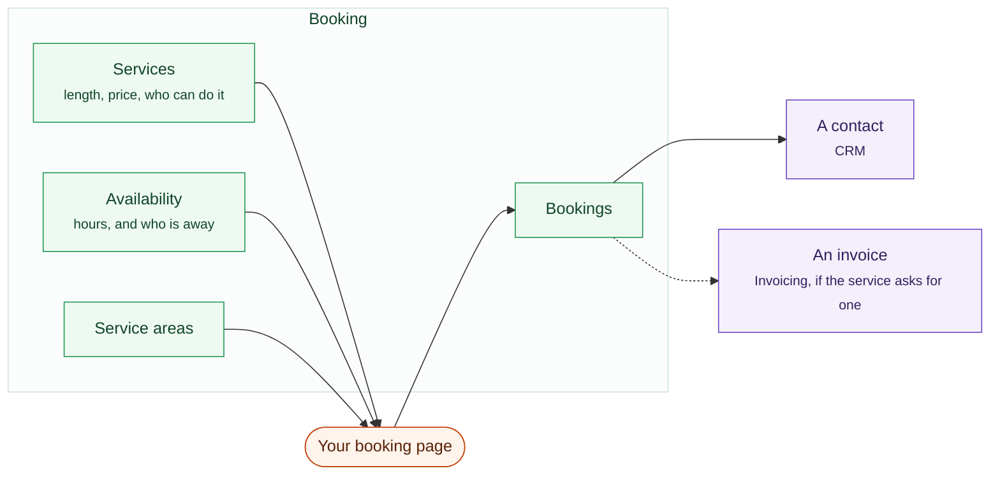
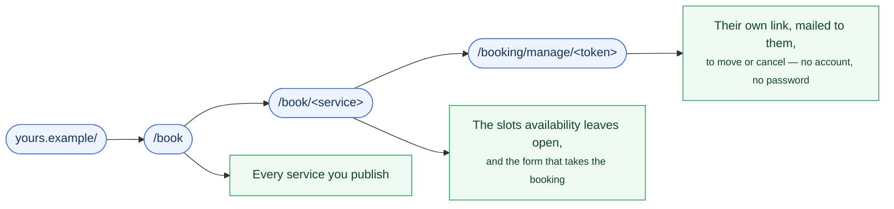

# Booking

A booking page your customers can use to take a slot themselves, and a diary
that stays honest about what is free.

What a booking touches, from the service you defined to the invoice it
becomes.

```mermaid
flowchart LR
  classDef screen fill:#eef4ff,stroke:#3b6fd4,color:#16305e
  classDef own fill:#eefaf1,stroke:#219653,color:#10442a
  classDef out fill:#f4f0fb,stroke:#6b47c4,color:#31205e
  classDef pub fill:#fff4ec,stroke:#c4470f,color:#5a2207
  subgraph OWN[" Booking "]
    SVC["Services<br/><small>length, price, who can do it</small>"]:::own
    AV["Availability<br/><small>hours, and who is away</small>"]:::own
    BK["Bookings"]:::own
    AREA["Service areas"]:::own
  end
  PUB(["Your booking page"]):::pub
  CRM["A contact<br/><small>CRM</small>"]:::out
  INV["An invoice<br/><small>Invoicing, if the service asks for one</small>"]:::out

  SVC --> PUB
  AV --> PUB
  AREA --> PUB
  PUB --> BK
  BK --> CRM
  BK -.-> INV
  style OWN fill:#fbfdfc,stroke:#cfe4d8,color:#10442a
```

## Services

A **service** is something bookable: a consultation, a site visit, a treatment.
Each one has a duration and its own availability, plus a price if you charge
for it.

Duplicate a service when you offer the same thing at three lengths. Done with
one? Untick **Public** and it leaves the page while the bookings already made
against it stay where they are. A service that has ever been booked can't be
deleted, so the diary never ends up naming something nobody can look up.

Stopped offering it altogether? Open the service and untick **Taking
bookings**. Nobody can book it after that, not from the page and not through a
private link either. It stays in your list marked *Inactive*, its old bookings
stay in the diary, and ticking the box again brings it straight back.

## Availability

Set your working hours per day — several stretches where you want them, so
nine to twelve and two to five is a lunch break rather than a compromise —
and block out holidays. The booking page then offers only what is genuinely
free, because it reads your existing
bookings before it draws the grid. Two people cannot take the same slot,
unless you gave the service more than one place under **Places**: a class of
twelve stays on the page until the twelfth person takes it.

**How far ahead the page goes** is sixty days unless you say otherwise, under
Booking → Settings. Set that figure to 0 and there is no limit at all.

A service can carry its own window instead: a rolling number of days, or a
season with a start and an end. Where it does, the service wins. Leave all
three boxes empty and the instance figure applies — which is the part nobody
guesses, and the reason a date that should be free reads as unavailable.

A private link ignores the instance figure, because the whole point of one is
to book something the page does not offer. The service's own window still
holds: that's a fact about the service, not about the page.

Past the last month the window reaches, the arrow forward stops rather than
handing somebody an empty grid, which reads as "fully booked" and is the
opposite of what you meant.

## The booking page

```mermaid
flowchart LR
  classDef url fill:#eef4ff,stroke:#3b6fd4,color:#16305e
  classDef leaf fill:#eefaf1,stroke:#219653,color:#10442a

  ROOT(["yours.example/"]):::url
  BOOK(["/book"]):::url
  SVC(["/book/&lt;service&gt;"]):::url
  MAN(["/booking/manage/&lt;token&gt;"]):::url

  L1["Every service you publish"]:::leaf
  L2["The slots availability leaves open,<br/><small>and the form that takes the booking</small>"]:::leaf
  L4["Their own link, mailed to them,<br/><small>to move or cancel — no account, no password</small>"]:::leaf

  ROOT --> BOOK --> L1
  BOOK --> SVC --> L2
  SVC --> MAN --> L4
```

A public page that works on a phone, with no account and no app. One per
service, or one for everything. It shows a month at a time, then the times
available on the day somebody picks. Beyond a name and an email it asks only
for the questions you added, plus an optional phone number and note.

You can also **embed** it in your own website, inline in a page or behind a
button. Booking → Share writes the code for you. Add your site to *Sites
allowed to embed booking* under Booking → Settings first, or the browser
won't show it.

## Service areas

If you travel to customers, list the codes you cover in Booking → Settings.
The field is named the way your country names them: *ZIP codes you travel to*
in the US, *Postal codes* in Canada, *Postcodes* in the UK and the EU. A prefix
covers everything under it, so 802 covers 80202. Then tick *We come to the customer* on each service that happens
at their address. That service asks for an address, and somebody outside your
area is told so and the booking isn't taken, rather than you finding out after
driving there.

## What happens after a booking

- The customer gets a confirmation, then a reminder before the appointment:
  24 hours ahead unless you change *Remind customers* in Settings, and never
  if you set it to 0.
- A **contact is created or matched** in the CRM. A repeat customer stays one
  person instead of becoming a new record each time.
- An invoice is raised automatically **if you asked for one**: tick *Raise an
  invoice when it is booked* on the service, which needs a price on it and is
  off to begin with. Leave it off and the price is shown while the business
  bills the way it already does. Book six weekly sessions in one go and the
  invoice is one for the course, not six. A service that waits for your yes
  raises its invoice when you confirm, not when somebody asks. The invoice
  lands open in Invoicing, and the customer's confirmation email carries a
  link to view it. That's the same link Invoicing's own Share button hands
  out, not a second email. Want it sent as a proper invoice too, with the
  payment link a connected card processor adds? Send it from Invoicing like
  any other.
- The appointment counts toward *Today* and *Next seven days* on your
  dashboard.

Raising that invoice is never allowed to fail the booking. A booking whose
invoice was refused (no exchange rate recorded for the currency, say, or a
period you've closed) still stands, and says so: the row in Booking → Bookings
reads **Invoice not raised**, with the reason beside it. Put the reason right
and press **Retry**. It raises the invoice once, however many times it's
pressed, and needs permission to update bookings. Until then the booking is
counted under *Invoices not raised* on your dashboard, so nothing gets missed
because nobody opened the diary. A booking that vanished would be worse: that's
a customer standing outside a locked door.

## Cancellations

Your customer can move or cancel through the link in their confirmation, with
no account and no password. You cancel from the booking itself, under Booking →
Bookings. Either way, a canceled slot returns to the pool immediately.
