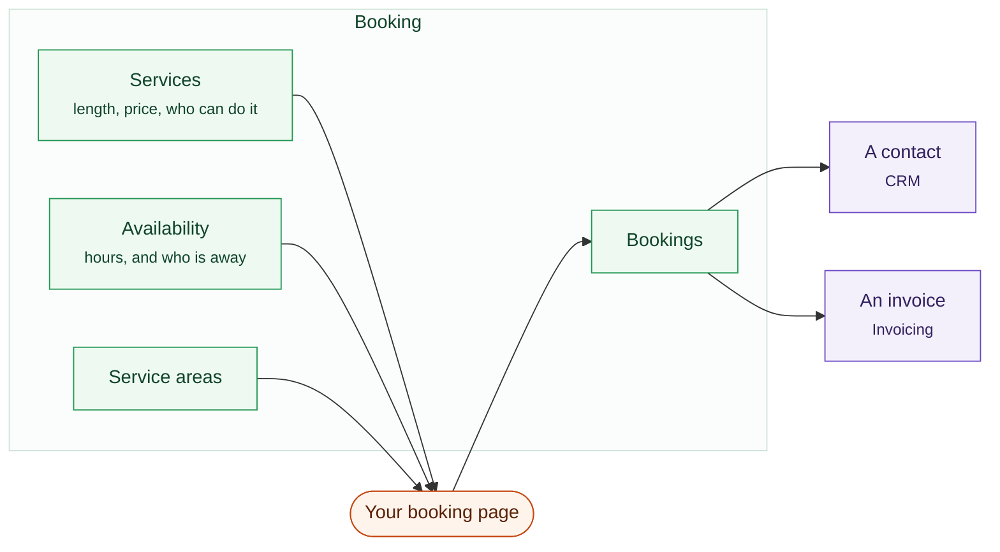

# Booking

A booking page your customers can use to take a slot themselves, and a diary
that stays honest about what is free.

What a booking touches, from the service you defined to the invoice it
becomes.

```mermaid
flowchart LR
  classDef screen fill:#eef4ff,stroke:#3b6fd4,color:#16305e
  classDef own fill:#eefaf1,stroke:#219653,color:#10442a
  classDef out fill:#f4f0fb,stroke:#6b47c4,color:#31205e
  classDef pub fill:#fff4ec,stroke:#c4470f,color:#5a2207
  subgraph OWN[" Booking "]
    SVC["Services<br/><small>length, price, who can do it</small>"]:::own
    AV["Availability<br/><small>hours, and who is away</small>"]:::own
    BK["Bookings"]:::own
    AREA["Service areas"]:::own
  end
  PUB(["Your booking page"]):::pub
  CRM["A contact<br/><small>CRM</small>"]:::out
  INV["An invoice<br/><small>Invoicing</small>"]:::out

  SVC --> PUB
  AV --> PUB
  AREA --> PUB
  PUB --> BK
  BK --> CRM
  BK --> INV
  style OWN fill:#fbfdfc,stroke:#cfe4d8,color:#10442a
```

## Services

A **service** is something bookable: a consultation, a site visit, a treatment.
Each one has a duration and its own availability, plus a price if you charge
for it.

Duplicate a service when you offer the same thing at three lengths. Retire one
and the bookings already made against it stay where they are.

## Availability

Set your working hours per day — several stretches where you want them, so
nine to twelve and two to five is a lunch break rather than a compromise —
and block out holidays. The booking page then offers only what is genuinely
free, because it reads your existing
bookings before it draws the grid. Two people cannot take the same slot.

**How far ahead the page goes** is sixty days unless you say otherwise, under
Booking → Settings. Set that figure to 0 and there is no limit at all.

A service can carry its own window instead: a rolling number of days, or a
season with a start and an end. Where it does, the service wins. Leave all
three boxes empty and the instance figure applies — which is the part nobody
guesses, and the reason a date that should be free reads as unavailable.

A private link ignores every one of them. The whole point of one is to book
something the page does not offer.

Past the last month with anything in it, the arrow forward stops rather than
handing somebody an empty grid, which reads as "fully booked" and is the
opposite of what you meant.

## The booking page

```mermaid
flowchart LR
  classDef url fill:#eef4ff,stroke:#3b6fd4,color:#16305e
  classDef leaf fill:#eefaf1,stroke:#219653,color:#10442a

  ROOT(["yours.example/"]):::url
  BOOK(["/book"]):::url
  SVC(["/book/&lt;service&gt;"]):::url
  MAN(["/booking/manage/&lt;token&gt;"]):::url

  L1["Every service you publish"]:::leaf
  L2["The slots availability leaves open,<br/><small>and the form that takes the booking</small>"]:::leaf
  L4["Their own link, mailed to them,<br/><small>to move or cancel — no account, no password</small>"]:::leaf

  ROOT --> BOOK --> L1
  BOOK --> SVC --> L2
  SVC --> MAN --> L4
```

A public page that works on a phone, with no account and no app. One per
service, or one for everything. It shows a month at a time, then the times
available on the day somebody picks, and it asks for nothing you did not say
you needed.

You can also **embed** it in your own website, inline in a page or behind a
button.

## Service areas

If you travel to customers, set the ZIP or postal codes you cover. Somebody
outside them is told so before they book, rather than after you have driven
there.

## What happens after a booking

- The customer gets a confirmation, then a reminder before the appointment.
- A **contact is created or matched** in the CRM. A repeat customer stays one
  person instead of becoming a new record each time.
- If the service has a price, an invoice is raised automatically. Book six
  weekly sessions in one go and that is one invoice for the course, not six.
  Where a card processor is connected, the invoice carries a payment link like
  any other.
- The appointment appears on your dashboard.

Raising that invoice is never allowed to fail the booking. An invoice that did
not go out is something you can see and fix; a booking that vanished is a
customer standing outside a locked door.

## Cancellations

Both sides can cancel through the link in the confirmation. A canceled slot
returns to the pool immediately.
