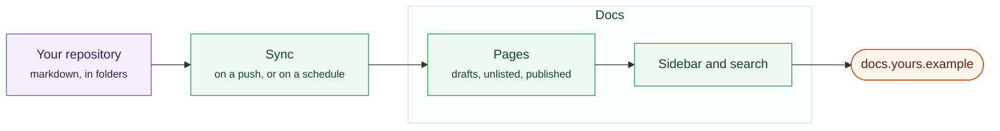
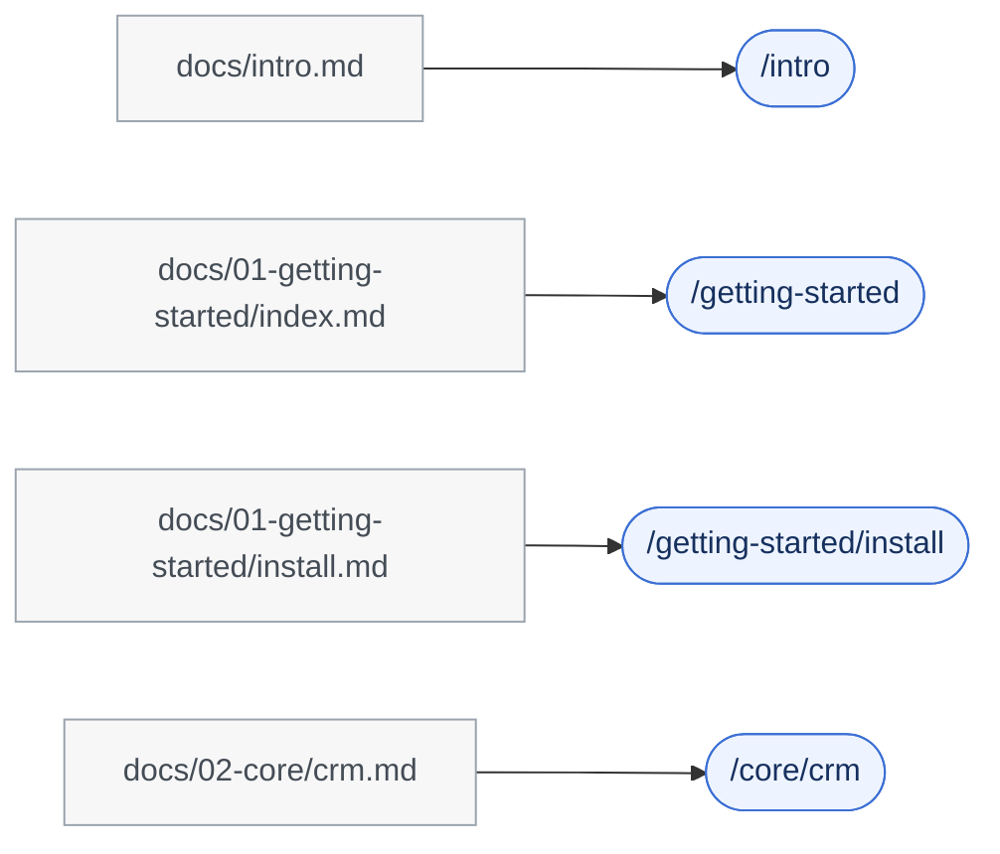

# Docs

Publish documentation from markdown files in **your own GitHub repository**,
public or private. A product manual. A staff handbook. An internal wiki.

You write in the repository. Sentrello publishes it.

A repository on one side, a published site on the other, and nothing to
deploy in between.

## Why a repository

Because documentation belongs under version control. History, review,
branches, and the ability to say exactly what the docs said in March. Your
writers also keep the tools they already use.

## Connecting one

**Docs → Settings**:

1. Enter the repository as `owner/name`, or paste its GitHub URL.
2. Choose the branch and the folder your pages are in, usually `docs`.
3. For a private repository, add an access token with read access to contents.
4. **Test connection.** It reports whether the repository is public or private,
   which branch is the default, and how many documentation files it found.
5. **Sync now.**

After that it syncs on its own, every hour.

:::info[Your token never comes back out]
The settings screen is told whether a token is saved, never what it is. A
screen that can read a secret back is a screen that leaks it to anyone who can
open it.
:::

## How your files become a site

A path in the repository becomes a path on the site. Numeric prefixes order
the sidebar and then drop out of the URL, so renaming a file to move it does
not break a link.

| In your repository | On the site |
|---|---|
| `intro.md` | A page at `/intro` |
| `guides/install.md` | A page at `/guides/install`, in a "Guides" section |
| `guides/_category_.json` | Names that section and orders it |
| `guides/index.md` | That section's own page |
| `01-first.md` | Ordered first; the number is not in the address |
| `_partial.md` | Not published; a leading underscore means a fragment |

The header block at the top of a file sets the title, its position in the
sidebar, tags, a description, and whether it is a draft.

## What you can write

Markdown, plus:

- **Admonitions** in five severities (note, tip, info, warning, danger), with
  your own titles.
- **Tabs**, which remember the reader's choice across pages.
- **Code blocks** with syntax highlighting, a title, highlighted lines and a
  copy button.
- **Diagrams** and **mathematics**.

Everything is rendered on the server. A page is readable before any script
runs, and it still reads correctly with JavaScript turned off entirely.

## Drafts and unlisted pages

A page marked `draft` is not published at all. A page marked `unlisted` is
reachable by its address but absent from the sidebar, from search and from the
sitemap. That is how you share something before announcing it.

## What the published site gives readers

Search, a sidebar, versions with banners for old ones, more than one language,
dark mode, a contents panel, previous and next, breadcrumbs, tags, and a
sitemap.

Nothing on a published page is fetched from anybody else's server. Your own
instance serves the mathematics and diagram libraries, which keeps your readers
out of a third party's logs and keeps the site working behind a firewall.
