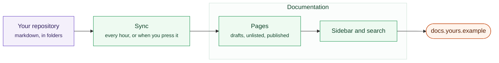
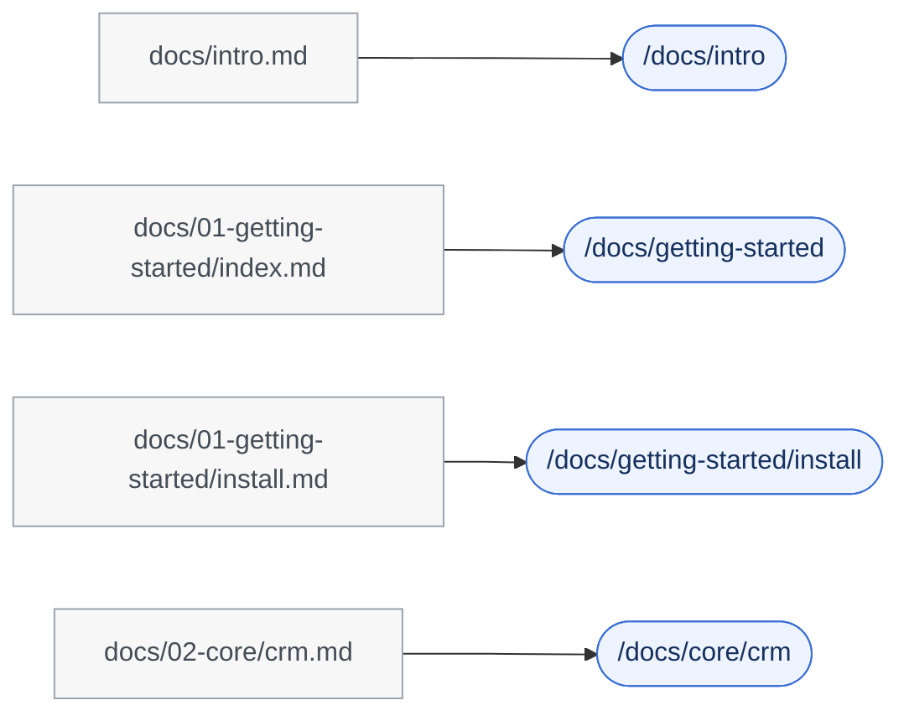

# Documentation

Publish documentation from markdown files in **your own GitHub repository**,
public or private. A product manual. A staff handbook. An internal wiki.

You write in the repository. Sentrello publishes it.

A repository on one side, a published site on the other, and nothing to
deploy in between.

```mermaid
flowchart LR
  classDef screen fill:#eef4ff,stroke:#3b6fd4,color:#16305e
  classDef own fill:#eefaf1,stroke:#219653,color:#10442a
  classDef out fill:#f4f0fb,stroke:#6b47c4,color:#31205e
  classDef pub fill:#fff4ec,stroke:#c4470f,color:#5a2207
  REPO["Your repository<br/><small>markdown, in folders</small>"]:::out
  SYNC["Sync<br/><small>every hour, or when you press it</small>"]:::own
  subgraph OWN[" Documentation "]
    PAGES["Pages<br/><small>drafts, unlisted, published</small>"]:::own
    NAV["Sidebar and search"]:::own
  end
  SITE(["docs.yours.example"]):::pub

  REPO --> SYNC --> PAGES --> NAV --> SITE
  style OWN fill:#fbfdfc,stroke:#cfe4d8,color:#10442a
```

## Why a repository

Because documentation belongs under version control. History, review,
branches, and the ability to say exactly what the docs said in March. Your
writers also keep the tools they already use.

## Connecting one

**Documentation → Settings**:

1. Enter the repository as `owner/name`, or paste its GitHub URL.
2. Choose the branch and the folder your pages are in, usually `docs`.
3. For a private repository, add an access token with read access to contents.
4. **Test connection.** It reports whether the repository is public or private,
   which branch is the default, and how many documentation files it found.
5. **Sync now.**

After that it syncs on its own, every hour.

:::info[Your token never comes back out]
The settings screen is told whether a token is saved, never what it is. A
screen that can read a secret back is a screen that leaks it to anyone who can
open it.
:::

## How your files become a site

A path in the repository becomes a path on the site, underneath wherever the
site lives. That is `/docs` unless you change it on the site's settings, and
everything below hangs off it. Numeric prefixes order the sidebar and then drop
out of the URL, so renaming a file to move it does not break a link.

```mermaid
flowchart LR
  classDef file fill:#f7f7f8,stroke:#9aa3ad,color:#444c55
  classDef url fill:#eef4ff,stroke:#3b6fd4,color:#16305e

  A["docs/intro.md"]:::file --> A2(["/docs/intro"]):::url
  B["docs/01-getting-started/index.md"]:::file --> B2(["/docs/getting-started"]):::url
  C["docs/01-getting-started/install.md"]:::file --> C2(["/docs/getting-started/install"]):::url
  D["docs/02-core/crm.md"]:::file --> D2(["/docs/core/crm"]):::url
```

| In your repository | On the site |
|---|---|
| `intro.md` | A page at `/docs/intro` |
| `guides/install.md` | A page at `/docs/guides/install`, in a "Guides" section |
| `guides/_category_.json` | Names that section and orders it |
| `guides/index.md` | That section's own page |
| `01-first.md` | Ordered first; the number is not in the address |
| `_partial.md` | Not published; a leading underscore means a fragment |

Keep more than one version and each gets its own segment in between —
`/docs/v2/guides/install` — except the one you publish at the root, which
carries none.

The header block at the top of a file sets the title, its position in the
sidebar, tags, a description, and whether it is a draft.

## What you can write

Markdown, plus:

- **Admonitions** in six kinds (note, tip, info, warning, danger, caution),
  with your own titles.
- **Tabs.** Give a set of tabs a `groupId` and the reader's choice carries
  across every page that uses the same group.
- **Code blocks** with syntax highlighting, a title, highlighted lines and a
  copy button.
- **Diagrams** and **mathematics**.

The page itself is rendered on the server. Text, headings, tables, code and
the sidebar are all there before any script runs, and they read correctly with
JavaScript turned off entirely. What needs the small script on the page is the
interactive part: the search box, switching tabs, the dark mode toggle and the
copy button. Without it, every tab's content is still on the page.

Two things are drawn in the browser, because drawing them anywhere else means
shipping a rendering engine with the module. A diagram falls back to its own
source, which is readable prose; a formula falls back to what you typed. They
are the only reason a page ever loads a script file, only on a page that has a
diagram or a formula, and the files come from your own server, never somebody
else's.

### Pictures

Link a picture by a relative path, like ``,
and the sync brings it along. It reads the file from the same repository,
stores a copy on your instance, and points the page at that copy, so the
picture shows on the site without you changing a line.

What it copies, and what it leaves:

- **PNG, JPEG, GIF and WebP.** Each one is converted to WebP on the way in and
  scaled down if it's wider or taller than 2,400 pixels. A GIF arrives as a
  still of its first frame.
- **Not SVG.** An SVG can carry script, so it's left as it was written and
  the sync tells you which ones it skipped.
- **Up to 5 MB a picture, and 50 MB of pictures each sync** (per version and
  language, when you have more than one). Past either limit the picture keeps
  its original link, and the sync's report names it.
- **Only inside the synced folder.** A path that climbs out of it with `..`
  isn't followed, and neither is one starting with `/`.

Stop using a picture and the next sync removes its copy. A picture linked by
its full address, `https://…`, is loaded from wherever it lives, as before.

## Drafts and unlisted pages

A page marked `draft` is not published at all. A page marked `unlisted` is
reachable by its address but absent from the sidebar, from search and from the
sitemap. That is how you share something before announcing it.

## What the published site gives readers

Search, a sidebar, versions with banners for old ones, more than one language,
dark mode, a contents panel, previous and next, breadcrumbs, tags, and a
sitemap.

Nothing the site itself needs is fetched from anybody else's server. Your own
instance serves the mathematics and diagram libraries, which keeps your readers
out of a third party's logs and keeps the site working behind a firewall. The
only exception is one you choose: an image you link from somewhere else is
loaded from there.
