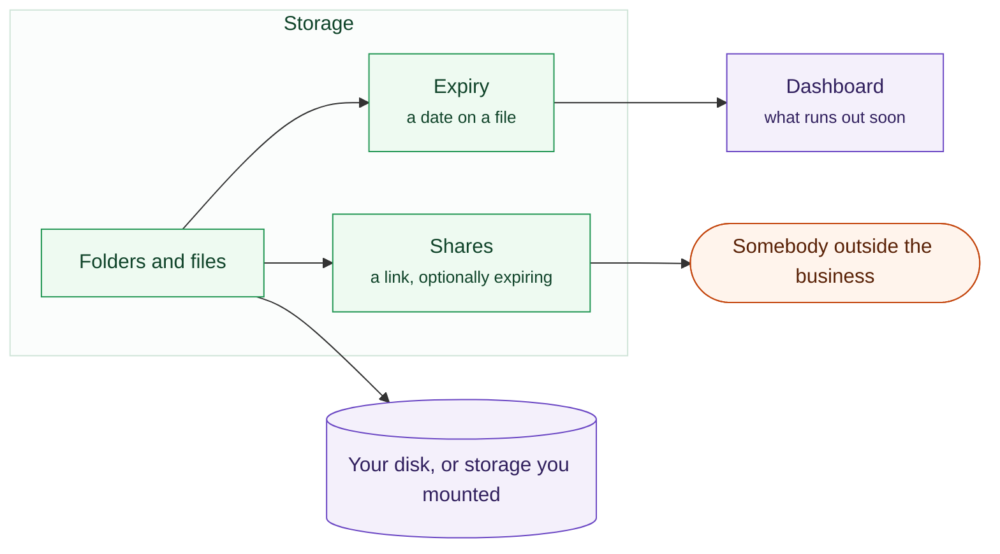

# Storage

Somewhere to put the paperwork, with the one feature that actually saves money:
knowing when something is about to expire.

Files, who may see them, and the dates that matter.

## Folders and files

A normal folder tree. Upload anything. Whatever the browser can preview, it
previews, so you are not downloading a file to find out what it is. Attach a
file to a contact or a company and a customer's paperwork sits with the
customer.

## Expiry

This is the point of the module.

Give a file an **expiry date** and a category: insurance, certificate, licence,
contract. Anything approaching its date appears on the dashboard. Anything past
it appears in red.

:::warning[This is the failure that costs real money]
A lapsed insurance certificate or trade licence can mean a business is not
legally able to work. It is a date nobody was looking at, on a document nobody
opened. Putting it on the first screen is the whole feature.
:::

## Sharing

Any file can be shared by link, password-protected or not, expiring or not. The
recipient needs no account. Useful for sending a customer something too large
to email.

## Downloading in bulk

Select several files, or a whole folder, and download them as one archive.

## Where the files actually live

On your own server, under your own control. There is no third-party storage
account behind this, and nothing leaves the machine unless you share it
deliberately.
