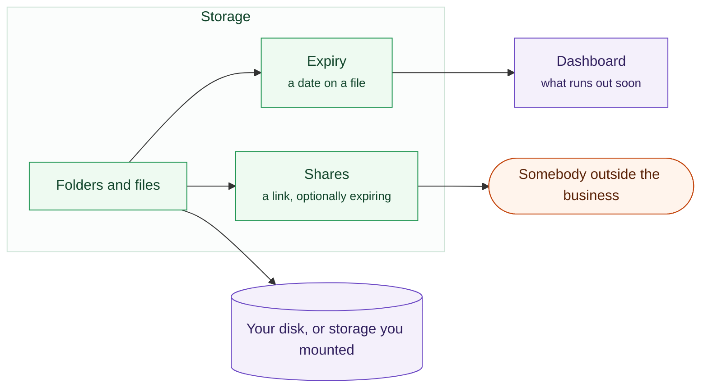

# Storage

Somewhere to put the paperwork, with the one feature that actually saves money:
knowing when something is about to expire.

Files, who may see them, and the dates that matter.

```mermaid
flowchart LR
  classDef screen fill:#eef4ff,stroke:#3b6fd4,color:#16305e
  classDef own fill:#eefaf1,stroke:#219653,color:#10442a
  classDef out fill:#f4f0fb,stroke:#6b47c4,color:#31205e
  classDef pub fill:#fff4ec,stroke:#c4470f,color:#5a2207
  subgraph OWN[" Storage "]
    F["Folders and files"]:::own
    EXP["Expiry<br/><small>a date on a file</small>"]:::own
    SH["Shares<br/><small>a link, optionally expiring</small>"]:::own
  end
  DISK[("Your disk, or storage you mounted")]:::out
  DASH["Dashboard<br/><small>what runs out soon</small>"]:::out
  OUT(["Somebody outside the business"]):::pub

  F --> DISK
  F --> EXP --> DASH
  F --> SH --> OUT
  style OWN fill:#fbfdfc,stroke:#cfe4d8,color:#10442a
```

## Folders and files

A normal folder tree. Upload anything. Whatever the browser can preview, it
previews, so you are not downloading a file to find out what it is.

Folders are how you find things again, not how you keep them apart: anybody
with access to Storage can open every file in it. Access is granted once, for
the whole module, on the person's role.

A file can also say **which customer it is about**, picked from your CRM on the
way in or added afterwards — most filing happens later, when somebody goes
looking for the contract rather than on the day it was signed. The row then
reads "For Ridgeline Roofing", and an erasure request for that customer reaches
the file with it.

## Expiry

This is the point of the module.

Give a file an **expiry date** and a category: insurance, certificate, licence,
contract. Anything approaching its date appears on the dashboard. Anything past
it appears in red — and a certificate expiring *today* is still good today, in
your own timezone, so it reads as expiring rather than expired.

**And you are emailed about it**, which matters more than either, because the
document you have forgotten is the one you are not going to see on a screen.
A digest goes out while anything is inside thirty days or already lapsed — to
whoever filed it and to the administrators, since the person who uploaded a
certificate two years ago may well have left. The same document is mentioned
once a week at most: thirty emails about one certificate is how somebody
learns to filter mail from their own software, and then misses the one that
mattered.

:::warning[This is the failure that costs real money]
A lapsed insurance certificate or trade licence can mean a business is not
legally able to work. It is a date nobody was looking at, on a document nobody
opened. Putting it on the first screen is the whole feature.
:::

## Sharing

Any file can be shared by link, password-protected or not, expiring or not. The
recipient needs no account. Useful for sending a customer something too large
to email.

## Downloading a folder

Download a whole folder and it arrives as a single zip with the folder tree
intact. Individual files download one at a time; there is no way to tick five
and get one archive.

## Where the files actually live

On your own server, under your own control. There is no third-party storage
account behind this, and nothing leaves the machine unless you share it
deliberately.
