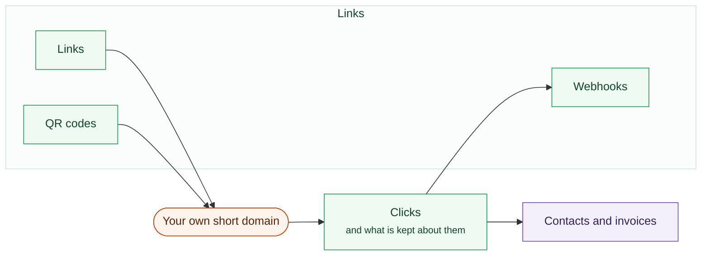
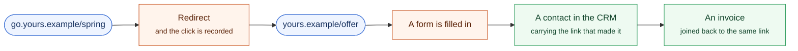

# Links

A shortener counts clicks. This one follows a person from the click through to
signing up and buying, so when you ask whether that campaign was worth running,
the answer comes back in money rather than traffic.

One short link, and everything it is joined to.

## Your own domain

Two things make a short link worth having: it is short, and it carries your own
name. Point a domain at your instance, add the TXT record it gives you, and
your links are served on it.

**Until that record is there, nothing is served on the domain.** An unverified
host answers nothing at all. Nobody gets to point a domain they do not own at
your instance and have it serve links.

You can also set where a bare visit goes, for somebody who saw the domain on a
van and typed it on its own, and where an unknown link goes, for a typo or a
link you deleted.

## Making a link

| Field | What it does |
|---|---|
| **Send people to** | The destination |
| **Called** | The short key. Leave it blank and one is made up |
| **On** | Which of your verified domains, or this instance |
| **Folder and tags** | Somewhere to put a campaign's links, and what they are for across folders |

Delete a folder and its links stay where they are, filed under nothing. Delete
a tag and it comes off the links carrying it; the links themselves are
untouched.

A link that has been clicked is archived rather than deleted, so last month's
report does not change underneath you.

### The rest of the options

- **Campaign source, medium and campaign.** The usual tags, added to the
  destination
- **Send iPhones and Android somewhere else**, for app store links
- **An expiry date**, and where somebody who follows it afterwards lands. Blank
  is a dead end
- **A password.** Anyone with the link is asked for it
- **Cloaking**, which keeps your address in the bar. It breaks the back button,
  and the screen says so
- **Search engine indexing**, off by default
- **Split the traffic** between two and four addresses, each with the share of
  visitors it gets, over a date range. A test with no end is a permanent random
  redirect, and the screen says that too

## Following people past the click

That last join is the part other link shorteners cannot do. They stop at the
click, because the click is all they have.

This is the part a shortener does not do.

Paste a snippet on your own site, then have **your own server** tell your
instance when somebody signs up or buys. The reports then put clicks, people,
signups, sales and revenue side by side, per link.

Your server is what reports it, not a script in the visitor's browser, and it
authenticates with a tracking key your instance issues. **Nothing is loaded
from us and no third party sees your visitors.** The key is shown once when it
is issued; issue another and it replaces the first.

## What is kept about visitors

People who click a link are not your customers and have not agreed to anything.
The module says plainly what it holds about them, and lets you decide.

- **How long a returning visitor is recognised**, from a day up to a year.
  Longer means a repeat visit is not counted as a new person
- **Whether the visitor's IP address is kept at all.** Off keeps nobody's
  address; visitors are counted by a one-way hash that stops meaning anything
  when the window ends
- **For how long, if it is kept.** Cleared automatically once older than that,
  and turning the setting off clears them all at once

**In the UK and the EU an IP address is personal data.** If you keep them, say
so in your privacy notice. The screen says this where the setting is.

### Forgetting one person

Somebody asks to be erased. This clears every stored copy of their address. The
**clicks stay counted**, because they are your own traffic figures and deleting
them would rewrite last month's report.

## Reports

Clicks and people over a period, grouped by country, city, device, browser,
system, where they came from, or whether the link or a QR code was used. Plus
which link earned what: clicks, signups, sales and revenue per link.

## What it needs

Pro underneath it, like every module. Nothing else. The redirect, the tracking
and the reports all run on your own instance.
