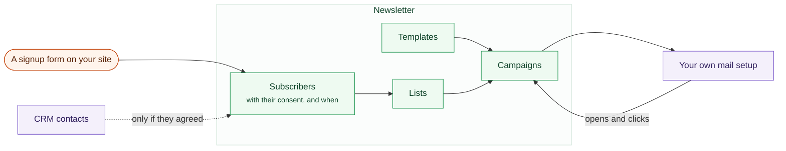

# Newsletter

Run a mailing list properly: lists, subscribers, campaigns, and honest numbers
about what happened to each message.

A list is not your customer list, and the arrow below only goes one way on
purpose.

## Lists and subscribers

A **list** is a group of people who agreed to hear from you. Public or private.
Single or double opt-in.

:::info[Double opt-in is a property of the list]
On a double opt-in list, nobody is written to until they confirm. In several of
the markets Sentrello is sold into, the difference between that and not is the
difference between marketing and an offence.
:::

Subscribers carry whatever attributes you want to keep. Import them from a
spreadsheet, export them in full whenever you like.

**An import does not resubscribe somebody who asked to stop.** An import is the
business speaking. A subscribe form is the person speaking, and only the second
of those undoes an unsubscribe.

## Signup forms

The usual way anybody joins a mailing list is a form on your own website. Build
one, choose the lists a signup joins, paste the snippet into any page, even a
page on a site that has nothing else to do with Sentrello.

A form asks for an email address, plus a name if you want one. Lists set to
double opt-in still send their confirmation email, so a signup here joins on
exactly the terms the list already has.

**A signup can also become a CRM contact**, per form, and it stays off unless
you turn it on. Whether that is worth turning on depends on what the form asks
for. An address on its own makes a contact with no name against it, which is a
record somebody has to tidy later; an address and a name makes one worth
keeping. The builder tells you which of the two you have. It needs the CRM
installed, and without it the switch does nothing.

## Campaigns

Write a campaign, choose its lists, send a test to yourself, then schedule or
send it. Templates give you a consistent header, footer and colour.

Sending happens in batches so that a large campaign does not make the rest of
the application unresponsive. A campaign can be paused and resumed, and
**nobody is written to twice**: the recipients are written down before sending
starts, and each one moves from pending to sent exactly once.

Somebody on three of a campaign's lists receives one email.

## Counting

Opens and clicks are counted **only if you turn them on**. There is a third
setting as well, which keeps the counts without recording who made them.

Both carry obligations in the markets this is sold into. That is why neither is
on by default.

## Unsubscribing

Every message carries an unsubscribe link that works from a phone, in any mail
client, with no account and no JavaScript. An unsubscribe link that only
sometimes works will cost you a fine rather than a bug report.

## Subscribers are not customers

They are kept separately, and linked to a CRM contact where the address already
matches. Most subscribers gave you an email address and nothing else. Count
them as customers and every answer to "how many customers do we have" comes out
wrong.
