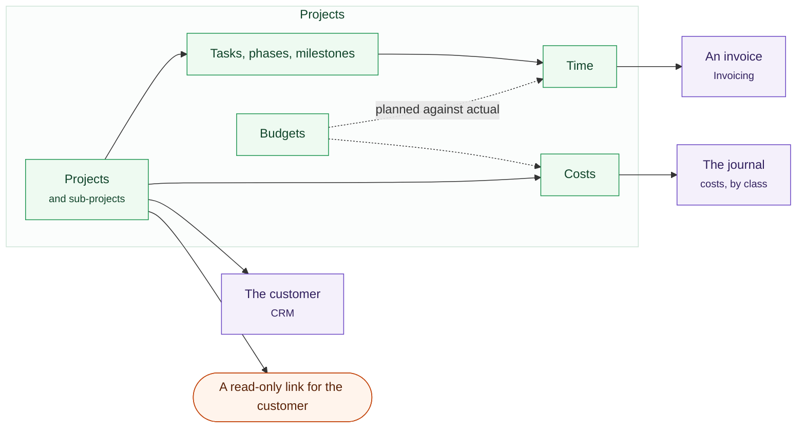

# Projects

Most project tools answer "what is everybody doing". The question that decides
whether a business keeps trading is narrower: did that job make money. This one
is built to answer the second without stopping answering the first, because the
hours are priced as they are logged, the costs post to the ledger you already
file from, and a billable hour becomes a line on an invoice rather than a figure
somebody retypes.

One job, and everything it is joined to.

## A project

A piece of work being done for somebody, with a start, an end and money against
it. It carries the customer it is for — a contact, a company, or both — and an
**accounting class**, which is what makes "did the kitchen job make money" a
question the profit and loss can answer instead of a spreadsheet.

Every project has a short key, up to twelve characters, and every task in it is
numbered from that: `KITCHEN-14`. That is the thing people say out loud on site,
and it is why the key is asked for when the project is made rather than offered
as a setting afterwards.

A project can sit under another one. A portfolio is not a separate kind of
object here — it is a project with projects in it.

## Tasks, phases and milestones

One item of work: a subject, who is doing it, when it starts, how long it takes
in **working** days, an estimate, and whether it is billable. A phase is a task
with tasks inside it. A milestone is a date with no duration — the day the
scaffold comes down, the day the client signs.

Both are a *type* on a task rather than their own object, so a milestone can be
assigned, commented on, blocked and reported like anything else, and nothing
needs converting when a milestone turns out to have work in it after all.

**Duration is in working days.** Add five days to a Thursday and you get the
following Thursday, not the Tuesday. Which days your business works, and which
days it is shut, are set once on Projects → Settings → the calendar; the default
is Monday to Friday. Clearing the whole week is refused, because every date in
the module is derived from it.

### What waits on what

Three relationships, and only the first one moves dates:

- **Comes before.** The successor starts after this one finishes, plus or minus
  a lag — a negative lag is an overlap, which is how a second trade starts
  before the first has quite finished. Move the predecessor and every automatic
  task downstream moves with it, with a note on each saying why it moved.
- **Blocks.** A task with an unfinished blocker cannot be closed. You are told
  how many are in the way.
- **Relates.** A link, and nothing else. There is no fourth kind: duplicates,
  includes and requires were all indistinguishable from this one in practice.

A task is **manual** or **automatic**. Automatic means its dates are derived
from what it waits on, and asking for it with nothing to derive from is refused
rather than quietly left where it was. A dependency that would make a loop is
refused too, with the sentence saying which way round the loop goes.

A parent's dates and progress come from its children: the earliest start, the
latest finish, and progress weighted by estimate — so a parent with one large
task and four small ones does not read 20% done when the large one is finished.

## The four ways to look at it

The same work, arranged for four different questions, as four screens rather
than four tabs. A screen nobody can find is a feature nobody has.

- **Board** (Projects → Views → Board) — cards in columns. Group by status,
  by who has it, by phase or by sub-project, and dragging a card sets that
  field. Every card also carries a plain dropdown, so the board can be driven
  from a keyboard or read out by a screen reader. Or make the columns yourself
  and drag cards between them.
- **Plan** (Projects → Views → Plan) — the Gantt. Drag a bar or move it with
  the arrow keys; click a name to say what it waits on. There is no charting
  library behind it, which means nothing between the dates and the pixels can
  disagree with the scheduler.
- **Calendar** (Projects → Views → Calendar) — every job's dates across one
  month, which is the one thing the plan cannot show. A task appears on every
  day it runs, and weeks start on Monday.
- **Team** (Projects → Team and cost → Team) — who is on what this week,
  booked against capacity, with a *Push out a week* control for the Monday when
  nothing has gone to plan.

A way of looking can be saved — with its grouping, and either privately or for
everybody.

## Time

Log an hour against a project, or against a task on it. Minutes, a day, a
comment, and whether it is billable; an hour against a task that is not
billable is not billable either, whatever the box says.

**The hour is priced when it is logged.** The rate card is dated, per person,
with a business default — so a rate rise in April does not reprice March, and
last year's job stays as costed as it was. Both figures are kept: what the hour
costs you, and what you charge for it.

More than twenty-four hours in one entry is refused. It is not a judgement about
anybody's day; it is almost always two days typed as one.

**Projects → Team and cost → Time** opens on your own week. Reading everybody
else's days takes the module's read permission, and recording your own takes the
time permission — which is the whole of who can see whose timesheet.

## Costs that are not time

Skip hire, scaffold, counsel's fee, the part that had to be couriered. Set up
the kinds of thing you buy once — a unit, what it costs, what you charge for it,
and which expense account it belongs in — and then record them against a job in
thousandths of a unit, so half a day is 500.

**Every cost posts a balanced journal entry**, tagged with the project's
accounting class, in the same transaction as the cost itself. If the ledger
refuses it, nothing is written and you are told. There is no second set of
books: the answer to whether a job made money comes from the one you file from.

Hours are deliberately not posted. A wage is already an expense by whatever
route it is paid, and posting the hour as well would count it twice.

## Budgets

A budget is what the job was supposed to cost: lines of somebody's hours and
lines of things bought, priced from the rate card and the cost types **as they
stood on the day the budget was priced**. A job can have more than one — a build
budgeted phase by phase.

A labour line with no rate in force on that date is refused, and the refusal
says so. Pricing it at nothing would switch the over-budget warning off for the
life of the job, which is worse than a sentence asking you to set a rate.
Logging an hour in the same situation is allowed, because stopping somebody
booking their day over a missing rate is how a timesheet stops being filled in.

**Projects → Team and cost → Budgets** is one row per job: planned, labour
spent, other costs, what is not yet invoiced, and the percentage of the budget
gone. That percentage is one definition, shared by the list, the money screen,
the warning and the customer's own page, so none of them can disagree with
another.

Over budget is said where somebody will see it: on the screen of the person who
just recorded the cost or logged the hour. There is no approval queue. Correcting
a budget writes a new one rather than editing the old one, because a report that
has already been read should not change under it.

## The hours become an invoice

The join this module exists for. **Projects → Projects**, open a job, and the
unbilled billable hours are grouped by task and ready to send.

One press raises a draft invoice in Invoicing, with a line per task: hours
times the rate where that divides exactly, and otherwise one line naming the
hours so the arithmetic on the document is always the arithmetic that was
agreed. Then each hour is marked against the line it became.

Three things follow from that, and they are the useful part:

- An invoiced hour cannot be edited or deleted. You credit the invoice instead,
  which is what the books require anyway.
- A project with invoiced time cannot be deleted. Archive it.
- If marking the hours fails after the invoice was raised, the invoice is
  voided rather than left half-done. In the one case where even the void fails,
  you get the invoice number and a sentence telling you to look at it.

A job with nobody to bill is refused before any of that happens: set who it is
for first.

## Work that comes round again

A monthly service visit, a quarterly audit. Mark a project as a template, then
set a schedule: every so many weeks, or every so many months — not days,
because "every 90 days" and "every quarter" drift apart within a year.

A template is copied with its board columns, its tasks, its structure and its
estimates, and **every date is shifted** by the gap between the template's start
and the new one. Assignees and progress are deliberately not carried over: a
template that quietly books somebody who left is worse than one that asks.

The copies are ordinary projects. A schedule owns nothing it has made, so
deleting the schedule leaves the work alone. A schedule whose template has gone
pauses itself rather than failing every night.

## The customer's own page

A read-only link you can hand to the customer, with no account and nothing to
sign into. It shows the phases and the milestones — not tasks, not assignees —
and money only if you say so, which is off to begin with.

The link is the whole credential, so it is revoked rather than deleted, and the
page records when it was last opened. If that customer also has an account with
you, the page links on to it.

Customers who do have an account see their live jobs there under **Your jobs**,
with how each one is going. That section never creates a share link of its own;
it reuses one you have already made.

## Settings

Projects → Settings holds the working week and the days you are shut, the rate
card, the kinds of cost you buy, and the recurring schedules. Board columns
belong to a project rather than to the business, because a strip-out and a
software build do not have the same stages.

Capacity in the team view is 450 minutes a working day and is not a setting. A
business that needs that number exact needs a rota rather than a planner.

## Permissions

| Permission | What it allows |
|---|---|
| `projects:read` | See the module and everything in it, including everybody's timesheet |
| `projects:create` | Start a project, add tasks, copy a template, add a schedule |
| `projects:update` | Change a project or a task, move dates, arrange a board, share a job |
| `projects:delete` | Delete a project, a budget or a schedule |
| `projects:log-time` | Book time and record costs |
| `projects:budget` | Set rates, cost types and budgets |

Time is separated from everything else on purpose: everybody on the job books
their hours, and far fewer people move dates or set a budget. Raising the
invoice needs Invoicing's own create permission as well — the money stays where
the money is.

## What it does not do

- **No status workflow.** Which role may move which type of task from which
  status to which other is a real feature at two hundred people and an empty
  configuration screen at nine.
- **No approval queue** for a budget, for the same reason. The over-budget
  answer arrives on the screen of the person who caused it instead.
- **Nobody is told** when a task they watch changes. Watchers are kept; there
  is no mail behind them yet.
- **Per-person capacity** is not configurable.

## What it needs

Pro underneath it, like every module. It uses the CRM for the customer, the
ledger for costs, Invoicing for the bill and the platform's own people and
permissions for everybody on the job — so there is no second list of accounts
and no second set of books.
