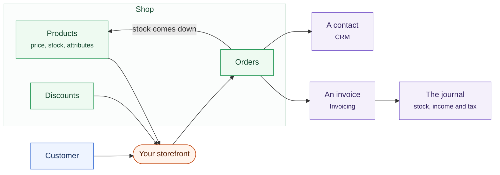

# Shop

An online shop whose orders arrive as records in the business you already run,
instead of in a separate system you reconcile at the end of the month.

What the module owns, and where each part of a sale ends up. The right-hand
column is the half a standalone shop cannot do for you.

## Products

Products with descriptions, images, prices and stock levels. Sizes and colours
are options on one product, not four near-identical products that drift apart
over a year.

An order **claims** stock rather than removing it. The goods are still on the
shelf until somebody packs them, so a business counting stock this afternoon
finds what is actually there. The count moves when the parcel goes out. For a
sale made at the counter with the [POS](/modules/pos) it moves immediately,
because the customer walks out holding it.

That is why the inventory screen shows three numbers, and why **Free to sell**
is the one that decides whether a sale can happen: what is on the shelf, less
what is already spoken for. A product can be hidden without being deleted.

Stock also reaches your books. A delivery becomes an asset on the balance sheet
and a debt to the supplier. When the goods are sold and leave, what they cost
you moves to Cost of Sales against that sale. That is the difference between a
profit figure that means something and one that is just your takings. See
[stock and what it cost you](/core/accounting#stock-and-what-it-cost-you).

## The storefront

A public shop, listing pages and product pages, working on a phone. It takes
your business's name, logo and details from Settings.

## Orders

An order records what was bought, by whom, at what price, and where it is
going. It starts **pending**. It becomes **paid** when the money is confirmed
with the processor, not when the buyer comes back from it. It becomes
**fulfilled** once everything on it has been despatched, and a part-despatched
order says exactly that rather than pretending to be complete. Orders can also
be **cancelled** or **refunded**; a refund puts the money back through the
books as its own entry.

A **customer is created or matched** in the CRM, so somebody who orders twice
is one customer with two orders.

## Payment

Connect a card processor in **Settings → Payments**: authorise, test in
sandbox, then go live. The same connection serves invoicing, so you set it up
once for the whole business.

## Where the money goes

A paid order posts to the ledger like any other income: the sale, the tax, the
money received. Your books include the shop without anyone entering anything
twice.

:::info[New in 0.19]
The processor's fee is recorded too, so Cash matches the bank. A card sale of
$100.00 puts about $96.80 in your account. From 0.19 the books say $96.80 and
put the $3.20 in **Payment Processing Fees**, instead of showing $100.00 and
leaving you to reconcile the gap by hand. Where a processor has not reported
the fee yet, the sale posts as it did before. Nothing is guessed.
:::
