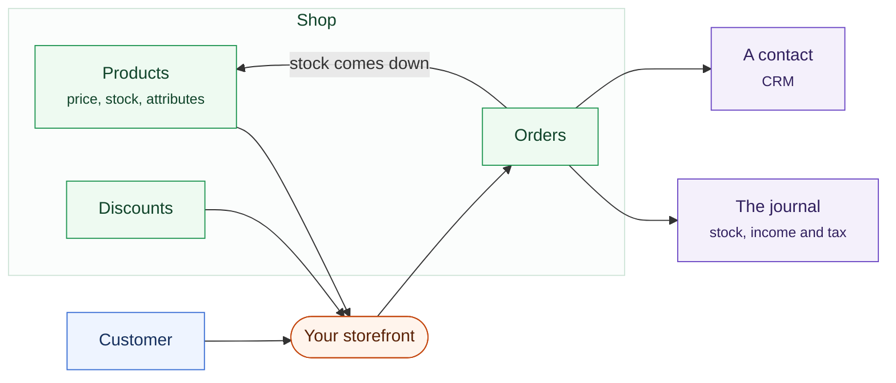

# Shop

An online shop whose orders arrive as records in the business you already run,
instead of in a separate system you reconcile at the end of the month.

What the module owns, and where each part of a sale ends up. The right-hand
column is the half a standalone shop cannot do for you.

```mermaid
flowchart LR
  classDef screen fill:#eef4ff,stroke:#3b6fd4,color:#16305e
  classDef own fill:#eefaf1,stroke:#219653,color:#10442a
  classDef out fill:#f4f0fb,stroke:#6b47c4,color:#31205e
  classDef pub fill:#fff4ec,stroke:#c4470f,color:#5a2207
  subgraph OWN[" Shop "]
    P["Products<br/><small>price, stock, attributes</small>"]:::own
    O["Orders"]:::own
    D["Discounts"]:::own
  end
  SF(["Your storefront"]):::pub
  CUST["Customer"]:::screen
  LED["The journal<br/><small>stock, income and tax</small>"]:::out
  CRM["A contact<br/><small>CRM</small>"]:::out

  CUST --> SF --> O
  P --> SF
  D --> SF
  O --> LED
  O --> CRM
  O -->|"stock comes down"| P
  style OWN fill:#fbfdfc,stroke:#cfe4d8,color:#10442a
```

## Products

Products with descriptions, images, prices and stock levels. Sizes and colors
are options on one product, not four near-identical products that drift apart
over a year.

An order **claims** stock rather than removing it. The goods are still on the
shelf until somebody packs them, so a business counting stock this afternoon
finds what is actually there. The count moves when the parcel goes out. For a
sale made at the counter with the [POS](/modules/pos) it moves immediately,
because the customer walks out holding it.

That is why the inventory screen shows three numbers, and why **Free to sell**
is the one that decides whether a sale can happen: what is on the shelf, less
what is already spoken for. A product can be hidden without being deleted.

Stock also reaches your books. A delivery becomes an asset on the balance sheet
and a debt to the supplier. When the goods are sold and leave, what they cost
you moves to Cost of Sales against that sale. That is the difference between a
profit figure that means something and one that is just your takings. See
[stock and what it cost you](/core/accounting#stock-and-what-it-cost-you).

## The storefront

A public shop, listing pages and product pages, working on a phone. It takes
your business's name, logo and details from Settings.

## Orders

An order records what was bought, by whom, at what price, and where it is
going. It starts **pending**. It becomes **paid** when the money is confirmed
with the processor, not when the buyer comes back from it. It becomes
**fulfilled** once everything on it has been despatched, and a part-despatched
order says exactly that rather than pretending to be complete. Orders can also
be **canceled** or **refunded**; a refund puts the money back through the
books as its own entry.

A **customer is created or matched** in the CRM, so somebody who orders twice
is one customer with two orders.

Two kinds of order are marked in the list and left out of the figures across
the top of it, and they mean different things:

- **sandbox** — paid through your processor's test keys. A real sale in your own
  books, which is why it posts like any other; it is only kept out of the
  takings so a test payment never reads as revenue.
- **practice** — rung up on a till in rehearsal mode. Never a sale at all: it
  posts nothing, moves no stock, and can be thrown away in one action. See
  [Rehearsing before you go live](/modules/pos#rehearsing-before-you-go-live).

## Payment

Connect a card processor in **Settings → Connections**: authorise, test in
sandbox, then go live. The same connection serves invoicing, so you set it up
once for the whole business.

## Where the money goes

A paid order posts to the ledger like any other income: the sale, the tax, the
money received. Your books include the shop without anyone entering anything
twice.

**Selling in a second currency.** Price a region in its own currency and a
visitor from that country pays in it. The order keeps that currency, and the
books keep yours: each order carries the exchange rate that stood when it was
placed, and the entry is posted in your own money at that rate. A rate you
record next March cannot restate what last October took. The takings figures and
a customer's lifetime spend are converted the same way, so every total on the
screen is in one currency rather than several added together.

:::caution[Two Canadian taxes, one rate]
A shop's tax is one rate per place — a country, and a region inside it where
you have named one. In British Columbia or Quebec that means entering the
combined figure, 12% or 14.975%, and the money is right to the cent: it is
what the customer pays and what reaches the books.

What the shop cannot yet do is tell the two taxes apart afterwards. GST and
the provincial tax answer to different authorities, and a shop rate is one
number. Both are percentages of the same consideration, so a bookkeeper can
split it — BC's 12% is five twelfths GST and seven twelfths PST — but it is
not a figure the shop produces.

Invoicing has no such limit: a line there can carry GST and PST as two named
taxes, each banded and reported separately. Splitting them in the shop is on
the roadmap, as it is for Subscriptions.
:::

:::caution[One US rate per state]
A shop order resolves the buyer's address to a **state** — the fifty, DC and the
five territories — and charges the rate written against it. Counties, cities and
special districts have no key of their own here, so a business collecting
Austin's tax enters the combined Texas-plus-Austin figure as its Texas rate. The
customer is charged exactly what they owe, to the cent, and that figure reaches
the books.

What it cannot do afterwards is say which part of it was the state's and which
the city's. The US filing report reads a shop order back by state, so a business
filing with a city as well as a state does that split by hand.

Invoicing has no such limit: a named rate there carries its own jurisdiction —
`US-TX` and `US-TX-Austin` are two rates, banded and reported separately, and
several can sit on one line. Raise the invoice there when the split has to come
out of the software rather than out of a spreadsheet.
:::

:::info[The processor's fee is on the books too]
So Cash matches the bank. A card sale of $100.00 puts about $96.80 in your
account, and that is what the books say — with the $3.20 in **Payment
Processing Fees** — rather than $100.00 and a gap for you to reconcile by hand.
Where a processor has not reported its fee yet, the sale posts without one.
Nothing is guessed.
:::
