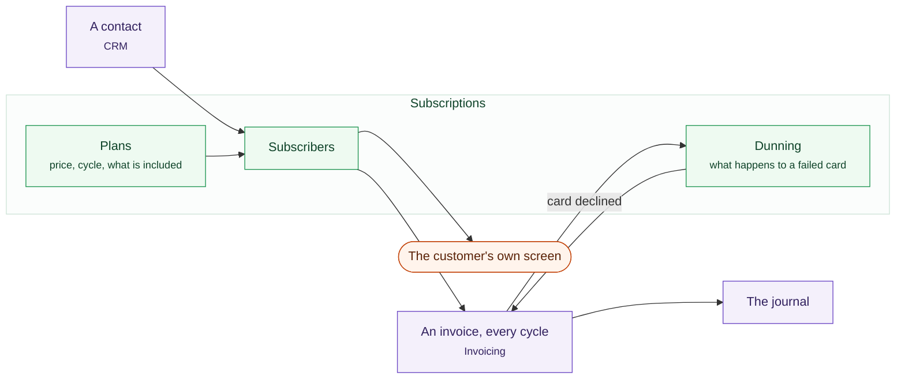

# Subscriptions

A wash club. A box every fortnight, a retainer, a membership, a monthly round.
Selling the same thing every month is a different business from selling a thing
once, and what it costs you is not the making. It is knowing who is on which
plan, whose trial ends this week, who is paused, and who has given notice.

**It does not need the Shop.** Subscriptions bills contacts through Invoicing,
which you already have. A gym, an agency on a retainer, an MSP and a window
cleaner can all run on it without ever selling anything online.

One plan, many subscribers, and an invoice every cycle that posts like any
other invoice.

## What it is built on

Nothing new. A subscription raises an invoice on the schedule Invoicing already
owns, and that invoice posts to the ledger like any other: one set of books,
and one place money is both recognised and chased from.

That is deliberate. Two things that each believe they own a renewal is how
somebody gets charged twice.

## Plans

**A plan is an item on your price list with a billing interval on it.** There
is no second catalogue. It is priced and taxed exactly like anything else you
sell, because a second catalogue would be a second answer to what a thing
costs.

Anything already on the price list can be promoted to a plan without retyping
its price, and a plan can carry a tax like any other line.

Withdraw a plan and nobody on it is disturbed. Subscribers keep the price and
the dates they agreed to.

**A plan can cost nothing.** That is how you give somebody the thing you sell:
a free tier, a charity, a partner, a long trial you do not want to end on a
date. They are subscribers like everybody else, in the same list and on the
same screen, and they are billed nothing. A subscription whose agreed price is
zero raises no invoice, sends no email and posts nothing to your books.

## Subscribers

A subscriber is a contact, a plan, and the price they agreed to. That price is
copied onto the subscription at signup rather than read back from the plan each
period. Raising your prices does not raise them for the people who joined last
year, and a plan edited on a Tuesday must not silently rebill everybody on
Wednesday.

| State | What it means |
|---|---|
| **Trialling** | On a plan, not yet billed |
| **Active** | Billed on schedule |
| **Paused** | Not billed, not cancelled, keeps its place — if you allow pausing |
| **Cancelled** | Ends on a date; it is not a switch thrown today |

Cancelling sets the date it takes effect rather than stopping the billing that
instant. Somebody who cancels on the 3rd of a month they have already paid for
keeps the rest of it, which is what they expect and what avoids a refund.

## Settings

The module has its own settings screen, and the first question people ask is
what lives there rather than at their payment processor. Cards, payment methods
and receipts belong to the processor and are managed there. What belongs to
your business is how you want the thing to behave:

| Setting | What it decides |
|---|---|
| **Allow pausing** | Whether a subscription can be paused at all. **Off until you turn it on.** |
| **Proration** | Whether a mid-cycle plan change settles now or on the next bill. **Next bill until you change it.** |
| **Chasing a failed payment** | How long, and how often, a failed card is chased before the subscription is parked |

**Pausing is off by default deliberately.** A paused subscriber pays nothing
and keeps everything the subscription carries, including any discount for
staying subscribed. That suits a gym or a grooming club. It does not suit a
software plan. Turn it on and the control appears in both places a pause can
happen: your own screen, and the subscriber's.

## The customer's own screen

Run the Shop as well and a subscriber can sign in to your storefront to cancel
their own subscription without emailing you about it, or pause it if you allow
pausing. This works whether or not the Shop is installed. The Shop reads the
subscription rows; nothing flows the other way.

## Permissions

Subscriptions uses the same people, roles and permissions as the rest of
Sentrello. There is no second list of accounts.

| Permission | What it allows |
|---|---|
| `subscriptions:read` | See plans and who is on them |
| `subscriptions:manage` | Create plans, move somebody between them, end a membership |

Ending somebody's membership is not the same job as raising an invoice for work
done, so it gets its own permission instead of riding on Invoicing's.

## Changing a plan mid-cycle

Two settings decide what happens, and the default is the one that cannot
surprise a subscriber.

**Next bill** (the default) leaves today's invoice alone and settles the
difference on the next one. **Immediate** raises the adjustment there and then.
Either way the arithmetic is the same: the unused days on the old plan come off
at the rate they were sold at, the new terms go on at the new plan's rate, and
tax follows each half separately because tax follows the amount actually
charged.

That treatment is correct in all four markets. US sales tax is due on what was
charged. Canadian GST/HST, PST and QST are each a percentage of consideration,
rounded per invoice line the way the CRA permits, and QST's 9.975% is held in
millionths so it survives the arithmetic unrounded to the final cent. UK and EU
VAT is adjusted in the period the change is made — output VAT on an upgrade's
extra consideration, and a reversal on the days a downgrade never supplied.

:::caution[Two Canadian taxes, one rate]
A subscription carries **one** tax rate. So a business in British Columbia or
Quebec enters the combined figure — 12% for BC, 14.975% for Quebec — and the
money is right to the cent: that is what the customer is charged and what
reaches the books.

What the platform cannot yet do is tell those two taxes apart afterwards. GST
and the provincial tax go to different authorities and want different returns,
and a subscription's tax is one number. The split is arithmetic a bookkeeper
can do — both are percentages of the same consideration, so BC's 12% is five
twelfths GST and seven twelfths PST — but it is not a figure this produces for
you.

Invoicing itself has no such limit: raise the invoice there and a line can
carry GST and PST as two named taxes, each banded and reported separately.
Splitting them inside a subscription is on the roadmap. The Shop has the same
single rate for the same reason.
:::

:::caution[One US rate per state]
A subscription resolves the buyer's address to a **state** — the fifty, DC and the
five territories — and charges the rate written against it. Counties, cities and
special districts have no key of their own here, so a business collecting
Austin's tax enters the combined Texas-plus-Austin figure as its Texas rate. The
customer is charged exactly what they owe, to the cent, and that figure reaches
the books.

What it cannot do afterwards is say which part of it was the state's and which
the city's. The US filing report reads a subscription back by state, so a business
filing with a city as well as a state does that split by hand.

Invoicing has no such limit: a named rate there carries its own jurisdiction —
`US-TX` and `US-TX-Austin` are two rates, banded and reported separately, and
several can sit on one line. Raise the invoice there when the split has to come
out of the software rather than out of a spreadsheet.
:::

## Chasing a failed card

A subscription business loses more money to failed cards than to cancellations,
so a failed payment is not simply an overdue invoice here. The subscription
itself knows it is in trouble.

It moves `active` to `past_due` once the invoice goes unpaid, emails the
customer promptly rather than weeks later, retries on the schedule you set, and
comes to a stated end: paid at any point and it returns to `active`, retries
exhausted and it becomes `unpaid`. Status shows the trouble on every screen
that already shows status. How long and how often is the **Chasing a failed
payment** setting above.

## What it does not do

- **No usage-based or metered billing.** A plan has a price, not a meter. If
  what you sell varies by how much somebody used, this is the wrong module and
  raising the invoices yourself is the right answer.
- **No refund to the card on a downgrade.** Money owed back becomes a credit
  against the `Customer Credits` account and is spent on the next subscription
  invoice before the card is charged. That is deliberate: the customer is
  still a customer, another invoice is coming, and returning money to a card
  costs you a fee to hand back what you are about to ask for again. When you
  genuinely want to refund, Money's refund path does it.
- **No restating tax on the days already invoiced.** If a tax rate changes
  between the sale and a mid-cycle change, the unused days keep the rate they
  were sold at. Re-reading the rate would restate a supply that has already
  been invoiced, and that is a correction rather than a proration.

## If the module lapses

You keep every subscription you sold. The records are the platform's own,
and nothing is deleted or altered — but **billing stops**. The run that
turns a subscription into an invoice belongs to this module, so when the
module goes, the invoices stop being raised.

That is the honest answer and it is worth saying plainly, because this page
said the opposite until 28 September 2026: a business whose licence lapsed
would quietly stop billing every subscriber it had, and find out when
somebody noticed the money had not arrived.

Nothing is lost by it. Every subscription stands, with its price, its
discount and its next date, and the day the licence comes back the run
picks them up and carries on from where it stopped. If you would rather
keep billing without the module, each one can be re-made as a recurring
invoice before you let it go.

**The subscriber's own page goes too**, and that is the part worth acting on
before rather than after. Pause, resume and cancel reach a subscriber through a
link this module serves, so when the module stops loading the link stops
answering and somebody wanting to cancel has to ask you instead. End the ones
that should end while the screens are still there.
